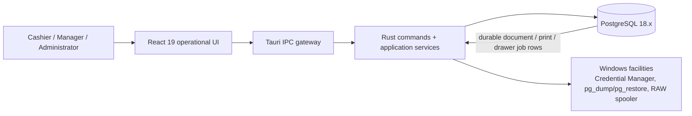
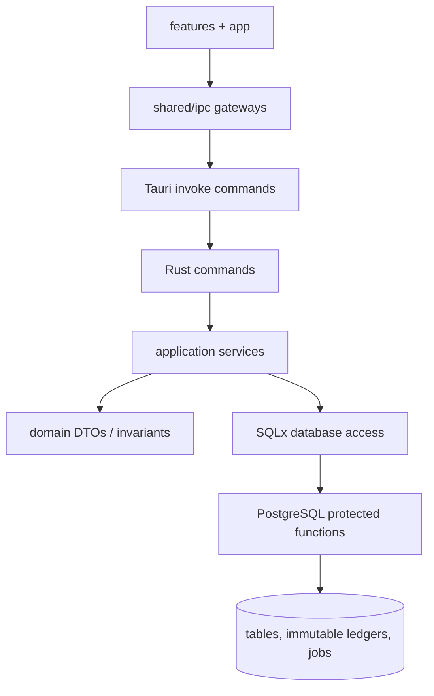
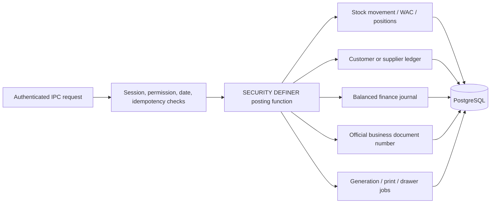
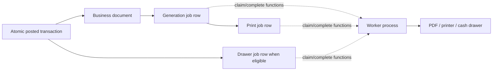

# Stockiha Architecture

## 1. Document purpose

This is the repository-grade architecture reference for Stockiha. It is for engineers, technical leads, security reviewers, operations staff, and future maintainers who need to distinguish the runnable desktop application from its proofs, recovery work, and roadmap.

**Inspection:** 2026-08-16

**Git ref inspected:** `21af3d6741dcbd8cc3c8879eb31e8d5345f70d55` (`fix/purchase-confirm-recovery`)

**Workspace note:** pre-existing deletions below `.agents copy/` were not used as architectural evidence and were not changed.

### Evidence labels

- `[CONFIRMED]` — directly evidenced by current code, configuration, tests, migrations, or Git.
- `[INFERRED]` — strongly implied by implementation, but not stated as a product contract.
- `[PARTIAL]` — implemented in some form, without a complete or proven end-to-end capability.
- `[PLANNED]` — explicitly described in the authoritative roadmap or slice documents.
- `[RECOMMENDED]` — a next action derived from recorded gaps; it does not change the architecture.
- `[UNKNOWN]` — cannot be reliably determined from this workspace.

Source-of-truth order is: running/tested behavior and applied migrations; current code/configuration; then `Stockiha_Audit_Redesigned_Roadmap_2026-08-02.md` for target architecture and remaining scope. `CURRENT_SLICE.md` and `TASKS.md` are execution trackers, not stronger evidence.

## 2. Executive architecture summary

[CONFIRMED] Stockiha is a single-company, single-store Windows desktop ERP for catalogue, inventory, procurement, point-of-sale, customers/receivables, cash control, accounting journals, documents, and controlled historical onboarding. It is a modular monolith: one Tauri v2 desktop process hosts a React frontend and Rust command layer, which connects to a local PostgreSQL 18.x database.

[CONFIRMED] Financial and inventory authority resides in PostgreSQL protected functions and immutable ledger/movement tables. React renders workflows and invokes typed Tauri IPC gateways; it is not an accounting, authorization, or stock-validation authority. Rust is primarily an IPC/application adapter and validates request shape, canonical payload hashes, and safe error translation before calling SQLx.

[PARTIAL] Core flows, including products, receipts, WAC, cash and credit sales, procurement, customer payments, documents, recovery, and historical staging, have code, migrations, and a combination of Rust, frontend, and PostgreSQL tests. The active branch also contains a direct-purchase recovery candidate. The release evidence remains incomplete for physical document printing/drawer actuation, Windows/Tauri acceptance of the active procurement candidate, and several operational hardening concerns.

[CONFIRMED] This is not a market-data, portfolio/watchlist, broker, payment-gateway, cloud-service, or AI/LLM application. No implementation evidence exists for those subsystems.

### Architecture at a glance



## 3. Verified technology inventory

| Area | Technology | Status | Evidence |
|---|---|---|---|
| Desktop shell | Tauri v2 | `[CONFIRMED]` production dependency | `src-tauri/Cargo.toml`, `src-tauri/tauri.conf.json` |
| UI | React 19, TypeScript, Vite | `[CONFIRMED]` production UI | `package.json`, `src/` |
| Rust runtime | Rust 2021, Tokio | `[CONFIRMED]` backend/runtime | `src-tauri/Cargo.toml` |
| Persistence | PostgreSQL 18.x, SQLx 0.8 | `[CONFIRMED]` production database/query/migration layer | `src-tauri/Cargo.toml`, `.github/workflows/ci.yml` |
| Exact numerics | `rust_decimal`; PostgreSQL `numeric` | `[CONFIRMED]` authoritative money/quantity/WAC/journal representation | `src-tauri/Cargo.toml`, `src-tauri/src/domain/money.rs`, migrations |
| Authentication | Argon2 password/PIN verification, opaque token hashed with SHA-256 | `[CONFIRMED]` local application authentication | `src-tauri/src/application/auth.rs`, `20260722125408_iam_users_roles_permissions_and_sessions.sql` |
| Documents | Typst/PDF, `pdf-lib` frontend utilities | `[PARTIAL]` generation implementation and queues exist; physical delivery is not proven | `src-tauri/src/infrastructure/customer_pdf/`, `src-tauri/src/infrastructure/pdf_proof/`, `package.json` |
| Printing/drawer | Windows RAW spooler proof, durable PostgreSQL jobs | `[PARTIAL]` no confirmed resident job worker or hardware proof | `src-tauri/src/infrastructure/escpos_proof/`, `documents` and `cash` migrations |
| Backup/restore | `pg_dump`, `pg_restore`, Windows Credential Manager | `[PARTIAL]` controlled operator commands/validation exist; no scheduled/off-device retention | `src-tauri/src/application/recovery*.rs`, `src-tauri/src/infrastructure/*proof/` |
| Testing | Vitest/Testing Library; Rust unit tests; PostgreSQL SQL and race suites | `[CONFIRMED]` | `tests/`, `src-tauri/tests/`, `.github/workflows/ci.yml` |
| CI | GitHub Actions | `[CONFIRMED]` | `.github/workflows/ci.yml` |
| Containers/IaC/orchestration | Docker, Compose, Kubernetes, Terraform, Pulumi, Helm | `[UNKNOWN]` / no repository implementation found | repository root and tracked infrastructure search |
| Cache, broker, event bus, search/vector store | Redis, Kafka, RabbitMQ, Elasticsearch, vector DB | `[UNKNOWN]` / no repository implementation found | dependency/configuration search |
| SaaS observability | Sentry, Datadog, Prometheus, Grafana | `[UNKNOWN]` / no repository implementation found | dependency/configuration search |
| AI/LLM and market data | OpenAI/Anthropic/Gemini/Ollama, market feeds, portfolios, alerts | `[UNKNOWN]` / no repository implementation found | dependency/configuration search |

## 4. Repository topology and boundaries

```text
Stockiha/
├── src/                         React application
│   ├── app/                     shell, router, application data context
│   ├── features/                workflow-oriented screens
│   └── shared/                  IPC gateways, session, i18n, components
├── src-tauri/
│   ├── src/                     Rust commands, application, domain, infrastructure
│   ├── migrations/              ordered PostgreSQL schema/function migrations
│   ├── tests/                   SQL integration and concurrency suites
│   ├── capabilities/            Tauri permission capability
│   └── tauri.conf.json          application/bundle/CSP configuration
├── tests/                       frontend unit and workflow tests
├── docs/                        ADRs and slice acceptance specifications
├── fixtures/, test_fixtures/    controlled import/test inputs
├── scripts/, run-app.bat        development and operational helpers
├── .github/workflows/ci.yml     CI definition
└── DESIGN.md                    UI and frontend-boundary specification
```

[CONFIRMED] There is one repository and one application, not a package-managed monorepo. There is no separate HTTP API, service deployment, shared package, or remote backend. The external interface is the local Tauri command set registered in `src-tauri/src/lib.rs`.

[CONFIRMED] Intended dependency direction is:



[CONFIRMED] `DESIGN.md` requires components to use the `src/shared/ipc/` gateways rather than scattering `invoke()` calls. The Rust command/application/domain/infrastructure folders make the same logical separation, although the crate remains one deployable unit. `[INFERRED]` Domain types are chiefly request/response validation and serialization boundaries; the database is intentionally authoritative for final business transitions.

## 5. Frontend and user workflows

[CONFIRMED] `src/app/AppRouter.tsx` registers operational screens for setup, login, dashboard, product/catalogue management, stock receipt and adjustment, POS, cash sessions, customers/credit, procurement, journals, document detail/printing, recovery, drawer policy, opening state, and historical onboarding. `AppShell.tsx`, `AppDataContext.tsx`, and `SessionContext.tsx` provide application/session state and navigation.

[CONFIRMED] Feature folders reflect business workflows rather than a generic component library: `features/products`, `inventory`, `pos`, `cash-session`, `customers`, `procurement`, `documents`, `onboarding`, `accounting`, `settings`, `setup`, and `auth`. Shared code provides reusable form/error primitives, English/French/Arabic localization, RTL handling, decimal display helpers, and IPC DTOs/gateways.

[PARTIAL] Browser-level tests exercise many workflows using mocked gateways (`tests/*.workflow.test.tsx`), but they do not prove the Windows WebView, an actual database, or hardware behavior. The production UI is backed by Tauri IPC rather than an HTTP/GraphQL API.

## 6. Backend/API architecture

[CONFIRMED] Tauri commands are registered centrally in `src-tauri/src/lib.rs`. Commands in `src-tauri/src/commands/` are thin adapters for auth, catalogue, sales, cash sessions, customers/receivables, procurement, inventory, documents, recovery, setup, onboarding, reference data, fiscal data, warehouses, and drawer policy.

[CONFIRMED] Application modules in `src-tauri/src/application/` construct request DTOs, parse validated dates/decimals, calculate canonical payload hashes where needed, call SQLx, and map internal errors to stable IPC errors. `src-tauri/src/error.rs` redacts sensitive database/credential/provider detail before it crosses IPC.

[CONFIRMED] There is no HTTP REST, GraphQL, gRPC, WebSocket, or public remote API server. The Tauri IPC command contract is the API surface. The default capability permits the expected core Tauri operations in `src-tauri/capabilities/default.json`; the application CSP is restrictive in `src-tauri/tauri.conf.json`.

### Representative transaction request flow

```mermaid
sequenceDiagram
    participant U as Operator
    participant R as React workflow
    participant G as IPC gateway
    participant C as Rust command/application
    participant P as PostgreSQL protected function
    participant D as Ledger, stock, document, job tables

    U->>R: Confirm sale / receipt / purchase
    R->>G: Typed request with idempotency key
    G->>C: Tauri invoke
    C->>C: Parse DTO and canonicalize/hash payload
    C->>P: SQLx function call
    P->>P: Resolve session + permission; validate state
    P->>D: Atomic posting and enqueue durable jobs
    P-->>C: Official IDs/status/result
    C-->>R: Redacted typed result or error
```

## 7. Domain and financial architecture

[CONFIRMED] Rust domain modules cover identifiers, money, fiscal periods, products/catalogue, warehouses/stock, cash sessions, sales, journals, business-document numbers, procurement/suppliers, customers/receivables, drawer policy, queues, recovery, onboarding, opening state, and residuals (`src-tauri/src/domain/`).

[CONFIRMED] PostgreSQL schemas begin with `core`, `catalog`, `inventory`, `sales`, `finance`, and `iam` (`20260722125401_create_schemas_and_helpers.sql`), then extend into `cash`, `documents`, `procurement`, `receivables`, and historical/onboarding structures through later migrations. Migrations are forward-only ordered SQL files under `src-tauri/migrations/`.

[CONFIRMED] The central integrity model includes:

- Exact decimal/numeric values; authoritative money, tax, quantity, weighted-average cost, inventory value, and journals must not use floating point.
- PostgreSQL `SECURITY DEFINER` functions with fixed/schema-qualified search paths for protected transitions, e.g. session resolution, idempotency, official document numbering, stock and sales posting.
- Runtime-role restrictions: direct table writes are commonly revoked and the runtime is granted only selects and specific functions.
- Session-token identity and role/permission validation through `iam.application_sessions`, `iam.resolve_session`, and `iam.resolve_session_with_permission`.
- Request idempotency records in `core.request_idempotency`; posting workflows receive opaque request IDs/payload hashes.
- Immutable business-document, inventory movement, and journal behavior enforced by database schema/functions/triggers.

Evidence includes `20260722125403_core_document_sequences_and_business_documents.sql`, `20260722125405_inventory_warehouses_positions_and_movements.sql`, `20260722125407_finance_journal_entries_and_lines.sql`, `20260722125408_iam_users_roles_permissions_and_sessions.sql`, and `20260722125409_core_request_idempotency.sql`.

### Financial posting/data flow



[PARTIAL] The historical roadmap recorded serious S3 supplier-accounting defects and a subsequent R2 forward-only repair using GRNI/AP semantics. Current migrations include `20260803130000_r2_financial_semantics_foundation.sql` through `20260803131300_r2_supplier_return_and_payment.sql`, with regression evidence in `src-tauri/tests/procurement/r2_financial_semantics_integration.sql`. This document does not treat old migrations as proof that the original semantics remain correct; the repaired, later migrations are the operative candidate.

[PARTIAL] The active branch contains additional purchase/catalogue repair migrations and `20260816150000_direct_purchase_foundation.sql`. It is a recovery candidate, not an accepted pilot release. `docs/slices/R8-E-procurement.md` and `CURRENT_SLICE.md` retain the required Windows/Tauri procurement acceptance gate.

## 8. Persistence, data quality, and onboarding

[CONFIRMED] SQL migrations define catalogue/variants/units/barcodes; warehouse positions and movements; cash and credit sales; cash sessions/movements; journals; procurement orders, receipts, landed cost, invoices, returns, and payments; customers and receivables; document queues; recovery/audit controls; opening state; and historical staging. The current migration sequence is the definitive schema evolution record.

[CONFIRMED] Stock movements and finance journals are intended to be immutable after posting. Negative confirmed stock is forbidden by posting safeguards; historical-only records are deliberately isolated from live stock, cash, AR, AP, sales, purchases, and journals. The relevant control paths include `20260724130000_inventory_confirm_stock_adjustment.sql`, `20260724140000_inventory_zero_quantity_safeguards_and_rounding_residuals.sql`, and the `20260804*`/`20260807*` historical staging migrations.

[PARTIAL] Historical finance/trade spreadsheet ingestion exists in frontend parsers and controlled staging/analytics migrations. It is not a silent replay engine for operational ledgers. `src/features/onboarding/xlsxParser.ts`, `src-tauri/src/application/onboarding.rs`, and `src-tauri/tests/onboarding/` are primary evidence.

[CONFIRMED] A PostgreSQL 18 CI job applies all migration files in filename order against fixed roles, then runs the current SQL integration and concurrency suites. Its exact database setup is in `.github/workflows/ci.yml`.

## 9. Authentication, authorization, and security

[CONFIRMED] Initial setup provisions the first administrator through database-controlled setup functions. Login verifies Argon2 credentials in Rust, creates cryptographically random opaque session tokens, stores only their SHA-256 hash, and sends the raw token only through the live client session boundary. See `src-tauri/src/application/auth.rs`, `src-tauri/src/application/setup.rs`, and `20260722200001_core_system_state_and_bootstrap.sql`.

```mermaid
sequenceDiagram
    participant U as Operator
    participant UI as LoginScreen
    participant A as Rust auth service
    participant DB as iam schema
    U->>UI: Username + password/PIN
    UI->>A: Tauri login command
    A->>DB: Read eligible account and verify permissions/session rules
    A->>A: Argon2 verify; generate opaque token
    A->>DB: Store SHA-256 token hash and expiry
    A-->>UI: Token, safe session profile, expiry
    UI->>DB: Later protected call through Rust with token
    DB->>DB: SECURITY DEFINER resolves token + permission
```

[CONFIRMED] RBAC is stored in `iam.users`, `iam.roles`, `iam.permissions`, `iam.user_roles`, and `iam.role_permissions`. Database functions validate a session and specific permission for protected operations. Cashier/session ownership, manager escalation, and drawer-policy privileges are covered by dedicated SQL and UI tests.

[PARTIAL] Database connection configuration still has a documented development environment-variable route in `src-tauri/src/infrastructure/db.rs`; Credential Manager support exists for Windows recovery/proof paths. Roadmap/AGENTS security constraints require that raw credentials, tokens, hashes, and sensitive database errors are never exposed or logged.

[CONFIRMED] The Tauri CSP denies broad network/script/frame capabilities in production configuration. `[UNKNOWN]` There is no repository evidence of external identity providers, OAuth/OIDC, MFA, centralized secret management, encrypted-at-rest database configuration, network TLS, audit-log export, or a formal vulnerability scanning service.

## 10. Documents, printing, drawer, and asynchronous work

[CONFIRMED] `documents.generation_jobs`, `documents.print_jobs`, and cash drawer job structures persist work and statuses transactionally alongside posted documents. Customer-document migrations define enqueue, claim, complete/fail, list, and reprint functions; cash-sale paths enqueue receipt/print/drawer work. See `20260722125412_documents_generation_and_print_jobs.sql`, `20260730203000_customer_document_jobs.sql`, and `20260724140200_update_cash_sale_residual_handling.sql`.



[PARTIAL] The dashed worker path is deliberately not represented as a confirmed runtime service. Durable job schemas and functions exist, document generation is implemented, and a Windows RAW-spooler proof exists, but the roadmap says real workers and physical print/drawer output are not proven end-to-end. Printing failure must not roll back a confirmed document.

[UNKNOWN] No queue broker, cron scheduler, background service manager, push provider, email provider, SMS provider, or notification provider is implemented in the repository. User-facing notifications are local UI feedback, not a confirmed delivery subsystem.

## 11. Infrastructure, deployment, operations, and observability

[CONFIRMED] Windows is the primary target. `src-tauri/tauri.conf.json` configures Tauri packaging targets/icons and the desktop window; `run-app.bat` performs developer preflight then launches Tauri development. GitHub Actions validates the frontend, Rust library, and PostgreSQL 18 migrations/SQL suites on Ubuntu.

[PARTIAL] The backend contains Windows-specific integrations for Credential Manager and RAW printing, and backup/restore code invokes PostgreSQL utilities. A Linux CI/sandbox cannot prove Windows WebView2, Credential Manager, Windows spooler, physical ESC/POS/Arabic output, cash-drawer pulse, or installer behavior.

[CONFIRMED] Operator-facing backup creation, bundle validation, and temporary-database restore verification commands are registered. Backup role ACL and reconciliation regression tests exist under `src-tauri/tests/recovery/`.

[PARTIAL] Scheduled, retained, encrypted, off-device backup; live database replacement; signed installer/updater; and release automation remain deferred or planned in the roadmap. There is no Docker/Kubernetes/cloud deployment topology in the repository.

[PARTIAL] Error handling maps internal failures to stable/redacted IPC errors. Diagnostic `eprintln!` code exists in `src-tauri/src/error.rs`, but no structured logging, distributed tracing, metrics, alerting, dashboards, or production monitoring integration is evidenced.

## 12. Testing and reliability posture

[CONFIRMED] Frontend tests use Vitest and Testing Library; they cover gateways, i18n, error conversion, decimal/parser logic, and screens/workflows in `tests/`. Rust unit tests are colocated with domain/application/infrastructure modules. PostgreSQL integration assertions and concurrency races are in `src-tauri/tests/` and are invoked from `.github/workflows/ci.yml`.

[CONFIRMED] CI runs `npm run typecheck`, lint, tests, and build; then Rust formatting/check/clippy/library tests; then PostgreSQL 18 role bootstrap, ordered migrations, backup-role `pg_dump`, SQL suites, and stock/procurement/cash/credit race scripts.

[PARTIAL] CI is strong evidence for code/migration behavior but not evidence for the entire production transaction chain, deployed Windows desktop behavior, physical devices, or release packaging. Roadmap acceptance requires a controlled Windows/Tauri journey with exact candidate SHA and reconciled financial/inventory control totals.

## 13. Current implementation state and milestones

| Area | Current classification | Evidence |
|---|---|---|
| UI foundation and Tauri scaffold | `[CONFIRMED]` implemented | `src/`, `src-tauri/`, `TASKS.md` |
| Golden transaction chain | `[PARTIAL]` connected code/migrations; full operational proof incomplete | migrations `20260722125404`–`20260722200004`, roadmap §3 |
| Catalogue and inventory | `[PARTIAL]` implemented and actively repaired/verified | `src/features/products`, `src/features/inventory`, `src-tauri/tests/catalog`, `src-tauri/tests/inventory` |
| Procurement/AP | `[PARTIAL]` S3 repaired by R2; current direct-purchase work awaits acceptance | R2 migrations/tests, `docs/slices/R8-E-procurement.md`, current Git history |
| Customers/receivables/cash control | `[CONFIRMED]` implemented for stated scope, with SQL and workflow coverage | `src/features/customers`, `src/features/cash-session`, `src-tauri/tests/receivables`, `src-tauri/tests/cash` |
| Historical onboarding/opening state | `[PARTIAL]` staged and controlled; not live-ledger replay | onboarding migrations/tests, `src/features/onboarding` |
| Backup/restore | `[PARTIAL]` command/validation/temporary restore proof; no complete retention/disaster workflow | recovery modules/tests |
| Documents/hardware | `[PARTIAL]` durable queues and PDF/spooler proof, not physical worker validation | document migrations, infrastructure modules |
| Pilot acceptance | `[PARTIAL]` R8-D recorded accepted; R8-E requires focused Windows/Tauri confirmation | `CURRENT_SLICE.md`, `docs/slices/R8-E-procurement.md` |

Recent Git history shows ongoing recovery work after the R8-E candidate: procurement transaction implementation, document-report boundary repairs, complete purchase line fixtures, legacy catalogue contract repairs, and direct purchase foundation. This establishes a live repair branch, not an immutable release baseline.

## 14. Gaps and technical debt

- `[PARTIAL]` Physical document printing and cash-drawer workers/hardware acceptance are not proven; durable rows alone do not deliver output.
- `[PARTIAL]` The active procurement/direct-purchase candidate needs its specified PostgreSQL 18/Rust and focused Windows/Tauri acceptance before it can be represented as pilot-ready.
- `[PARTIAL]` Recovery is not yet scheduled, retained, off-device, encrypted, or a safe live-database replacement workflow.
- `[PARTIAL]` Observability is limited to local error handling and CI artifacts; production logging, monitoring, metrics, and alerting are absent.
- `[UNKNOWN]` External integrations, cloud hosting, remote API/security boundaries, feature flags, analytics, and third-party notification delivery have no repository implementation.
- `[PLANNED]` The roadmap defers TVA/HT/TTC/discount accounting, payroll, advanced analytics, updater work, confirmed hardware/package work, customer returns/credit notes/quarantine/write-offs, broader expenses/reports, and completion of the historical archive.

## 15. Recommended next milestones

1. `[RECOMMENDED]` Complete the exact R8-E acceptance gate for the active procurement candidate: PostgreSQL 18 migrations/SQL suites, Rust verification, and one real Windows/Tauri journey with reconciled inventory, GRNI/AP, journals, documents, localization, and restart persistence.
2. `[RECOMMENDED]` Implement and prove a bounded document/print/drawer worker lifecycle before claiming physical delivery; preserve the existing durable-job and non-rollback semantics.
3. `[RECOMMENDED]` Finish minimum operational hardening: credential lifecycle, operator recovery procedure, safe backup retention/storage policy, supported Windows packaging, and explicit manual hardware evidence.
4. `[RECOMMENDED]` Add structured, redacted application logging and a proportionate health/diagnostic model before expanding integrations; do not add cloud observability by assumption.
5. `[RECOMMENDED]` Advance only roadmap-approved finance/reporting/onboarding work after the pilot gate; preserve database-authoritative postings, forward-only corrections, and historical-data isolation.

## 16. Developer workflow and configuration

[CONFIRMED] Development prerequisites and Windows setup are documented in `README.md`. Frontend commands are defined in `package.json`; Rust commands run against `src-tauri/Cargo.toml`. CI uses Node 22, stable Rust, and PostgreSQL 18.

[CONFIRMED] Database URLs are environment-controlled for development/CI, while recovery code has fixed role/credential safeguards. Never place credentials in tracked scripts or reports. `CURRENT_SLICE.md` records that a previously committed local PostgreSQL credential must be treated as exposed and rotated/destroyed.

[CONFIRMED] Contributors must preserve `package-lock.json` and `src-tauri/Cargo.lock`, use forward-only migrations, avoid floating point for authoritative values, keep React non-authoritative, and validate the applicable frontend/Rust/PostgreSQL checks. `AGENTS.md` is the operational engineering contract.
