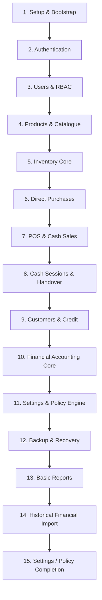

# Stockiha — Ground Truth & Product Roadmap

> [!IMPORTANT]
> **AUTHORITATIVE GROUND TRUTH.** This document is the single repository authority for Stockiha's target architecture, product scope, workstream organization, verified implementation health, and roadmap. It supersedes all historical roadmap and audit documents (archived under [`old-documents/`](./old-documents/README.md)). For actual runtime behavior, executable code, applied migrations, automated tests, and verified Windows behavior remain the ultimate empirical evidence.

---

## 1. Executive Product Vision & Architecture Principles

Stockiha is a single-company, single-store Windows desktop ERP built with **Tauri v2**, **React 19**, **TypeScript**, **Vite**, **Rust**, and **PostgreSQL 18.x**.

### Core Architecture Invariants
1. **Database-Authoritative Truth:** Financial, inventory, authorization, and posting decisions reside exclusively in PostgreSQL protected `SECURITY DEFINER` functions and immutable ledger/movement tables. React is strictly a presentation and workflow orchestration layer; Rust is a typed IPC adapter, validation boundary, and operating-system bridge.
2. **Exact Numeric Arithmetic:** Authoritative money, tax, quantities, weighted-average cost (WAC), inventory value, and journal entries must never use floating-point types. Exact numerics (`rust_decimal` and PostgreSQL `numeric`) are mandatory across all layers.
3. **Immutable Ledgers & Balanced Accounting:** Posted journals, inventory movements, and official business documents are immutable. All financial transactions must balance to zero. Corrections are executed solely via linked reversals or adjustments.
4. **Controlled Posting & Negative Stock Prevention:** Confirmed negative stock is forbidden at the database constraint level. All posting operations validate authenticated sessions, granular permissions, and request idempotency.
5. **Historical Data Isolation:** Historical spreadsheet ingestion and onboarding data must never silently replay into live operational ledgers. Staged data remains strictly isolated until explicitly reconciled and approved into opening state.
6. **Windows Desktop First:** Windows is the primary release target. Validation on Windows runtime, WebView2, Credential Manager, Windows spooler, physical ESC/POS receipt printing, Arabic RTL rendering, and cash-drawer actuation is a mandatory release gate.

---

## 2. Implementation Health Scores

Where project evidence has established health baselines, the following numerical health scores apply:

| Functional Area | Current Health Score | Current Condition & Key Findings |
|---|:---:|---|
| **Product Backend** | **6.5 / 10** | Solid data model, core validation, and posting functions; needs authorization consistency and admin deletion policies. |
| **Product Frontend** | **4.0 / 10** | Operational UI exists but requires a serious redesign for density, ergonomics, and seamless workflow handling. |
| **Procurement / Purchase** | **6.0 / 10** | Direct Purchase foundation established; requires comprehensive purchase history, return workflows, and enhanced UX. |
| **Historical Import** | **5.0 / 10** | Staging and XLSX parser proof exist; requires enhanced validation, duplicate prevention, and exhaustive testing. |
| **Barcode-First Search** | **5.0 / 10** | Implemented on inventory screens; must be expanded into a globally consistent barcode-first experience across POS and operations. |

---

## 3. Product Priority & Execution Order

The preferred sequence of dependency and development flow is:



### Strategic Priorities
1. **User Management & RBAC:** **CRITICAL MVP REQUIREMENT.** Multi-role hierarchy with database-enforced permissions.
2. **Financial Core:** **CRITICAL MVP REQUIREMENT.** Double-entry integrity, immutable journals, exact WAC, and customer/supplier ledger consistency.
3. **Windows / Tauri Acceptance:** **TOP PRIORITY RELEASE GATE.** Live desktop execution on Windows is required for any release milestone.
4. **Settings & Policy Engine:** **CRITICAL MVP REQUIREMENT.** Centralized policy layer governing business behaviors and toggles.
5. **Pillar Features Before Refinement:** Core operational flows (Products, Inventory, Purchases, POS, Cash, Finance) must stabilize before advanced reporting or audit refinement.
6. **Audit Trail:** **LATE-STAGE FEATURE.** Built toward the end when business workflows and transaction boundaries are fully finalized.
7. **POS & Cash Sessions:** **NEEDS SIGNIFICANT REVISION.** Requires comprehensive testing, cashier lifecycle revision, and drawer integration.
8. **Product Management:** **SERIOUS UI REDESIGN REQUIRED.** Improve product creation, variant editing, and category flows.
9. **Direct Purchase:** Accepted purchasing direction; requires detail views, history, and supplier returns.
10. **Stock Transfers & Backup/Recovery:** Require substantial testing and verification before being declared release-ready.
11. **Navigation (Sidebar & Topbar):** Redesign required for improved operational ergonomics and role awareness.
12. **Dashboard:** Redesign scheduled after core pillar features are stable.

---

## 4. Formal Workstream Structure

Roadmap execution is structured into twelve dedicated workstreams (**WS-A** through **WS-L**):

### WS-A — Foundation & Access
- **Objective:** Secure desktop host, bootstrap, authenticated sessions, and robust User Management / RBAC.
- **User Management / RBAC Policy:**
  - Standard roles: `SuperAdmin`, `Admin`, `Manager`, `Cashier`.
  - Custom roles with configurable permission sets created by authorized administrators/SuperAdmin.
  - Mandatory backend & database enforcement (`SECURITY DEFINER` session and permission checks), not merely UI hiding.
  - First-time setup provisioning and secure credential hashing (Argon2 + SHA-256 session tokens).

### WS-B — Financial Core
- **Objective:** Absolute financial and accounting integrity across all business operations.
- **Key Capabilities:**
  - Real-time double-entry general ledger with balanced debit/credit enforcement.
  - Subledgers for Accounts Receivable (AR) and Accounts Payable (AP).
  - Exact decimal calculations for all financial amounts.
  - Database-enforced posting locks and period cutoffs.
  - Controlled posting functions guaranteeing zero unlinked side effects.

### WS-C — Settings & Policy Engine
- **Objective:** Centralized configuration and business policy management.
- **Policy Engine Rules:**
  - All configurable business rules and features must be manageable and toggleable from Settings.
  - Configurable domains include:
    - Tax policy (Tax ON / OFF toggle; currently deferred/ignored in MVP calculations).
    - Stock transfer permissions and validation rules.
    - Discount policy (manual/configurable discounts supported; advanced discounts non-priority).
    - Inventory costing policy (WAC default, FIFO options).
    - Role definitions and granular RBAC permissions.
    - Cash session and blind-count reconciliation tolerances.
    - Procurement policies and approval thresholds.
  - Exclusions: Product image management is excluded from MVP settings (future work).
  - Admin product deletion capability governed by strict authorization policy.

### WS-D — Product & Inventory Core
- **Objective:** Robust catalogue management, stock tracking, barcode integration, and inventory analytics.
- **Scope:**
  - Product Backend (6.5/10) stabilization and Product Frontend (4.0/10) redesign.
  - Core inventory management: stock receipts, manual adjustments, zero-stock safeguards, and WAC recalculation.
  - Global barcode-first search across all operational screens (raising score from 5/10 to 10/10).
  - Inventory MVP includes advanced analytics (stock turnover, stock valuation, low-stock warnings).
  - Advanced inventory features beyond MVP (multi-location in-transit transfers, automated replenishment) are post-MVP.

### WS-E — Procurement & Supplier Operations
- **Objective:** Streamlined supplier management and goods acquisition.
- **Scope:**
  - Direct Purchase (current score 6.0/10) as the accepted purchasing foundation.
  - Supplier master data and AP integration.
  - Direct purchase entry, receipt posting, and landed cost allocation.
  - Required improvements: purchase history view, supplier returns/debit notes, and procurement UX enhancements.
  - Complex purchasing policies (multi-tier PO approvals, formal RFQs) deferred to future releases.

### WS-F — POS, Sales & Cash Operations
- **Objective:** Rapid, fault-tolerant point-of-sale and strict cash control.
- **Scope:**
  - Complete revision of POS and Cash Session workflows to resolve current deficiencies.
  - Cashier lifecycle: blind opening/closing counts, variance approval, handover, and shift reports.
  - Fast checkout with barcode scanning, cash/credit settlement, and receipt generation.
  - Manual discounts supported as configurable functionality.
  - Drawer-pulse job dispatch on eligible cash operations.

### WS-G — Historical Financial Import
- **Objective:** Safe, controlled onboarding of legacy business data.
- **Scope:**
  - Current health: 5.0/10. Requires enhancement, strict schema validation, and thorough error handling.
  - Ingest opening balances, customers, suppliers, and catalogue from spreadsheet formats.
  - Strict isolation: Historical data never directly mutates live operational ledgers.
  - Dedicated staging area, discrepancy review, CEO/Admin approval, and single atomic cutover posting.

### WS-H — Backup & Recovery
- **Objective:** Reliable data protection and disaster recovery for desktop deployment.
- **Scope:**
  - Current status: Not yet trusted; requires substantial automated and manual testing.
  - MVP Requirements:
    - Manual backup bundle creation (`pg_dump` with checksum validation).
    - Database restore capability (`pg_restore` into temporary validation target).
    - Backup integrity and database health/consistency verification.
  - Future Enhancements: Automated cloud sync, off-device retention, and scheduled encrypted backups.

### WS-I — Reporting & Analytics
- **Objective:** Operational insights and official financial statements.
- **Execution Policy:**
  - Pillar features must stabilize first before comprehensive reporting is prioritized.
  - Core MVP reports: Daily sales summary, cash session reconciliations, inventory valuation, customer statements, and trial balance.
  - High-level business dashboards and advanced predictive analytics follow core report stabilization.

### WS-J — Dashboard & Application UX
- **Objective:** Ergonomic, high-density, professional desktop user interface.
- **Scope:**
  - Full redesign of Application Shell (Sidebar and Topbar) for role-based navigation.
  - Dashboard overhaul scheduled after operational pillar workflows are finalized.
  - Full localization support: French (default), Arabic (complete RTL layout and typography), and English.
  - Dark mode and Light mode compliance with WCAG AA accessibility standards.

### WS-K — Windows / Tauri Acceptance & Release
- **Objective:** Production-grade Windows desktop packaging, reliability, and validation.
- **Scope:**
  - Mandatory release gate: All features must pass focused Windows/Tauri manual and automated acceptance journeys.
  - Hardware integration verification: Physical thermal receipt printers (ESC/POS), Arabic text rendering, and cash drawers.
  - Clean installer generation (NSIS/MSI) and secure local environment management.

### WS-L — Audit & Compliance
- **Objective:** Traceable change logs and regulatory compliance.
- **Execution Policy:**
  - Late-stage feature: Implemented toward the end after business workflows and entity schemas stabilize.
  - System activity log, permission change tracking, and immutable audit trails for sensitive financial/inventory operations.

---

## 5. Scope Boundaries: MVP vs. Deferred & Future Work

```
┌─────────────────────────────────────────────────────────────────────────────┐
│                             STOCKIHA MVP SCOPE                              │
├──────────────────────────────────────┬──────────────────────────────────────┤
│ Core & Foundation                    │ Operations & POS                     │
│ • Setup, Auth, RBAC (Multi-role)     │ • Product Management & Redesigned UI │
│ • Financial Accounting Core          │ • Core Inventory & Barcode-First     │
│ • Central Settings & Policy Engine   │ • Inventory MVP Advanced Analytics   │
│ • Windows / Tauri Acceptance         │ • Direct Purchase & Supplier AP      │
│ • Manual Backup, Restore & Health    │ • POS Checkout & Cash Sessions       │
│ • Controlled Historical Import       │ • Customer Receivables & Credit      │
│ • Basic Operational Reports          │ • Localized Shell (FR / AR / EN)     │
└──────────────────────────────────────┴──────────────────────────────────────┘
                                      │
                                      ▼
┌─────────────────────────────────────────────────────────────────────────────┐
│                          DEFERRED & FUTURE WORK                             │
├─────────────────────────────────────────────────────────────────────────────┤
│ • Payroll, Employee Contracts & Commissions                                 │
│ • TVA / Tax Functionality (currently ignored / zero-tax in MVP)             │
│ • Advanced Inventory beyond MVP (in-transit multi-warehouse transfers)      │
│ • Product Image Management & Media Storage                                  │
│ • Broader Procurement Policies (formal RFQ, multi-level PO approvals)       │
│ • Advanced Automatic Discounts & Promotional Rule Engines                   │
│ • Advanced Analytics outside MVP inventory                                  │
│ • Comprehensive Audit Trail & Compliance Subsystem (late-stage)             │
│ • Automated Off-Device / Cloud Encrypted Backup                             │
│ • Silent Automatic Application Updater                                      │
└─────────────────────────────────────────────────────────────────────────────┘
```

---

## 6. Document Hierarchy & Authority Rules

1. **`STOCKIHA_GROUND_TRUTH.md`** (this document) is the **single authority** for target architecture, product scope, workstream organization, and release priorities.
2. **`CURRENT_STEP.md`** tracks the active workstream, immediate focus, active blockers, and step verification.
3. **`TASKS.md`** records task execution progress.
4. **`AGENTS.md`** defines operational engineering constraints and safety protocols.
5. **`Architecture.md`** documents low-level technical structure, component topologies, and empirical evidence.
6. **`DESIGN.md`** defines design tokens, UI components, and design system rules.
7. **`old-documents/`** contains historical documents retained strictly for traceability.
