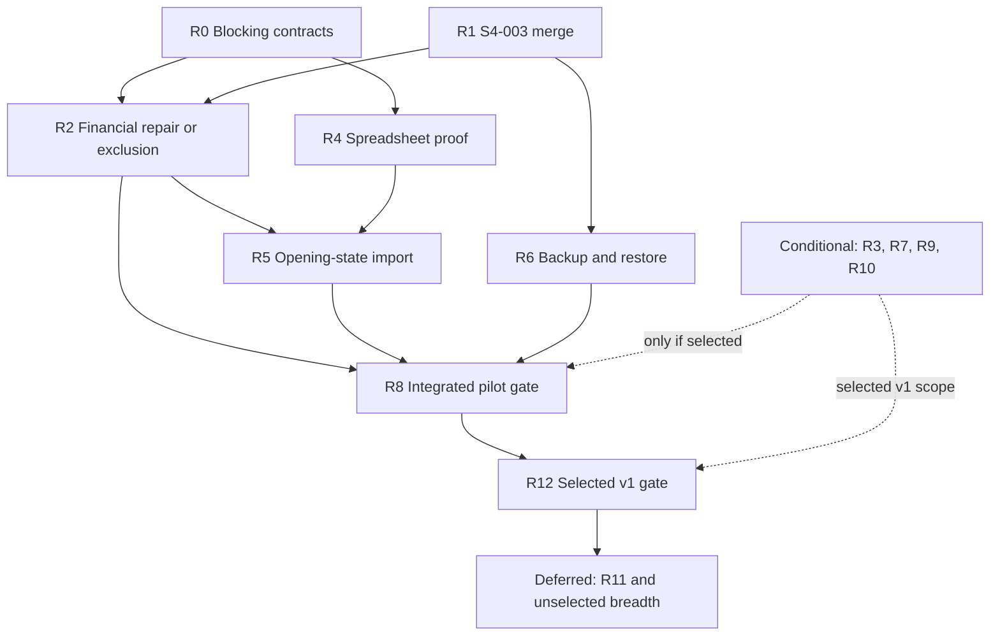

# Stockiha — Implementation Audit and Redesigned Roadmap

> [!IMPORTANT]
> **AUTHORITATIVE GROUND TRUTH — effective 3 August 2026.** This document is the single repository authority for Stockiha's target architecture, verified implementation state, release scope, and remaining roadmap. It supersedes the deleted `final-architecture.md` and any older architecture or roadmap claim. For actual current behavior, executable code, applied migrations, automated tests, and verified Windows behavior remain stronger evidence than status prose in any document.

**Audit date:** 2 August 2026  
**Deadline-optimization amendment:** 3 August 2026  
**Repository:** [NabilBNK/Stockiha](https://github.com/NabilBNK/Stockiha)  
**Authoritative released branch inspected:** `main` at [`b991f02555fa88bad405bd9f477acbd40a3860c9`](https://github.com/NabilBNK/Stockiha/commit/b991f02555fa88bad405bd9f477acbd40a3860c9)  
**Current candidate inspected:** PR [#9](https://github.com/NabilBNK/Stockiha/pull/9) at `7c940eafdd7c572e7c6fb795ba26d50c58a01522`  

This document authorizes no implementation by itself; work still follows the repository's execution and Git-safety rules.

## 1. Executive conclusion

### Reframed Problem:

The real problem is not simply how to finish the old S4→S9 sequence. That sequence is no longer compatible with the business deadline, and some items marked complete are only technical proofs or contain material defects. The project needs a release-scope correction, a financial-integrity repair, and a safe data-onboarding path before more feature breadth is added.

**Facts**

- `main` contains S0 through S4-002 and the UI foundation. PR #9 contains S4-003, is 44 commits ahead of `main`, zero behind, mergeable, and still a draft.
- PR #9 has green automated runs, including 88 frontend tests, 230 passing Rust tests, the full 64-migration chain, S4 database integration tests, two concurrency suites, and historical-schema upgrade workflows. Eleven live-database Rust tests are ignored rather than executed in that Rust job. See [Stockiha CI run 309](https://github.com/NabilBNK/Stockiha/actions/runs/30703585157).
- PR #9 has not passed its Windows/Tauri migration and manual acceptance gate. It also has no submitted review; the automated reviewer skipped review because the PR is a draft.
- S3 is not production-correct despite being checked complete in `TASKS.md`. Current SQL posts goods receipt directly to Accounts Payable instead of GRNI, posts a supplier invoice as a debit and credit to the same Accounts Payable account, uses the same account for supplier-return sides, and hardcodes cash even after selecting bank for a supplier payment. These entries can balance mathematically while being financially wrong.
- The system does not currently ingest Excel files. There is no spreadsheet parser dependency in the current Node or Rust manifests. The stale S7 branch only asks for a filename and row count; it does not read a file.
- Backup, restore, Windows Credential Manager, RAW printing, and the generic PDF proof are explicitly marked consumer-free or proof-only in the runtime source. The app still obtains its database URL from `STOCKIHA_DEV_DATABASE_URL`. No Windows release workflow was found in the inspected evidence; the conventional `release.yml` and `windows.yml` paths are absent.
- The old S5/S6/S7 branches are not future work ready for merge. They are each based on the pre-S4 commit `1976f59...`, are 172 commits behind `main`, and include cumulative, conflicting implementations of obsolete S4 work.

**Inference**

Delivering the complete original S0–S9 architecture as a trustworthy “final product” within 2.5 weeks is not credible. If the countdown starts on 2 August 2026, the one-week target is 9 August and the 2.5-week target is approximately 19–20 August. The only responsible interpretation is:

- **One-week target:** a controlled pilot MVP with a frozen narrow scope.
- **2.5-week target:** a production-candidate v1 with explicitly deferred features.

Calling the whole original plan complete by that date would be false.

**Recommendation**

Preserve the architecture that is working, finish the S4-003 gate, repair the financial posting defects with forward-only migrations, establish typed CEO settings, and move spreadsheet onboarding onto the critical path. Import opening operational state into live ledgers and keep the 1.5-year history isolated and reviewable. Do not replay unverified paper history directly into live stock, cash, receivables, payables, or journals.

The shortest responsible path is:

1. Verify and merge S4-003 with a focused, one-time Windows check of the changed workflows.
2. Freeze only the decisions that block coding: pilot scope, posting matrix, tax policy, and import columns.
3. Repair S3 financial semantics or disable procurement/accounting workflows for the pilot.
4. Prove and implement staged Excel/manual opening-state onboarding.
5. Deliver the minimum CEO settings actually required by the pilot; defer the generalized settings platform.
6. Prove backup/restore once on the pilot database.
7. Run one consolidated integrated Windows/Tauri acceptance gate.
8. Add hardware, packaging, returns, reports, and historical-search breadth only when they are confirmed launch requirements.

The roadmap below is cumulative, not a requirement to execute all thirteen steps before the deadline. R0–R8 contain the critical pilot path, with conditional scope inside R2, R3, R6, and R7. R9–R11 are deferred by default, and R12 validates only the production-candidate scope actually selected.

## 2. Verified current situation

### Evidence snapshot

| Area | Verified fact | Evidence strength |
|---|---|---|
| Official version | `main` ends at S4-002 merge commit `b991f025...` | Direct repository state |
| Current work | PR #9, S4-003, draft, mergeable, 44 commits ahead and 0 behind, 33 changed files, +4,512/−211 | Direct PR metadata and branch comparison |
| PR #9 automation | Five workflows completed successfully; main CI contains frontend, Rust, migration, S4 integration, concurrency, and upgrade checks | Direct workflow/job results |
| PR #9 manual gate | Windows/Tauri migration and manual checklist remain explicitly required | PR description and slice specification |
| Reviews | No submitted PR review or review threads; CodeRabbit skipped because draft | Direct PR review/comment state |
| Open issues | No open GitHub issues were returned for the repository | Direct issue search |
| Planning docs | `README.md`, `TASKS.md`, and `CURRENT_SLICE.md` on `main` disagree with merged code | Direct file contents |
| Current runtime connections | Product, inventory, POS, customers, procurement, cash sessions, documents, and settings routes/commands are registered | Current `AppRouter.tsx` and `src-tauri/src/lib.rs` |
| Spreadsheet ingestion | No Excel/CSV parser exists on the authoritative line; stale S7 UI does not open files | Current manifests and stale-branch source |
| Release operations | No Windows release workflow was found; conventional release/Windows workflow paths are absent; credentials, backup/restore, and RAW spooler are not production consumers | Current workflows and infrastructure module comments |

### What can be run today

The current candidate is a connected Tauri/React/Rust/PostgreSQL application, not a collection of empty interfaces. The candidate registers commands and screens for setup, login, products and variants, stock receipts and adjustments, cash/credit sales, customers and customer payments, cash-session lifecycle, supplier procurement, customer documents, customer payment refunds, and drawer policy settings. The authoritative route/command wiring is visible in [`AppRouter.tsx`](https://github.com/NabilBNK/Stockiha/blob/7c940eafdd7c572e7c6fb795ba26d50c58a01522/src/app/AppRouter.tsx) and [`src-tauri/src/lib.rs`](https://github.com/NabilBNK/Stockiha/blob/7c940eafdd7c572e7c6fb795ba26d50c58a01522/src-tauri/src/lib.rs).

The current candidate’s automated evidence is substantial but narrower than the status labels imply:

- Frontend: 13 files and 88 tests passed.
- Rust: 230 tests passed; 11 live-database tests were ignored.
- Database: all 64 migrations applied in order.
- Explicit database suites: S4 credit sales, customer payments, cash-session lifecycle/ownership, S4-003 drawer/refunds, cash-close concurrency, and credit-limit concurrency.
- Upgrade tests: historical S4-002 index/function/shape collisions and S4-003 function ownership.

The current CI workflow is visible at [`.github/workflows/ci.yml`](https://github.com/NabilBNK/Stockiha/blob/7c940eafdd7c572e7c6fb795ba26d50c58a01522/.github/workflows/ci.yml). Its PostgreSQL job is named “S4 integrity verification” for a reason: it does not execute a complete current database regression suite for S1, S2, and S3.

### What cannot honestly be claimed today

- S4-003 is not complete until the exact candidate passes Windows/Tauri validation and review.
- Procurement accounting is not safe for real financial use.
- Tax and discount processing is not implemented; the cash-sale migration explicitly says “no-tax, no-discount,” despite the architecture requiring that policy first.
- A balanced journal does not prove a correct journal. Current S3 entries demonstrate that semantic account errors pass the balance constraint.
- Physical print and cash-drawer queues are not proven end to end by the current app runtime.
- Backup/restore is not an operator-facing product workflow.
- Production database secrets are not loaded from Windows Credential Manager.
- There is no real Excel ingestion, historical reconstruction, payroll, advanced reporting, signed installer pipeline, automatic updater, or off-device encrypted backup.

## 3. Original plan versus actual implementation

The superseded architecture checklist was a plan, not a tracker; all S0–S9 boxes remained unchecked there. The table below uses the requested status classifications and treats current behavior/code/tests as more authoritative than checkboxes.

| Step | Original objective | Actual status | Evidence | Missing work | Problems or risks | Recommended action |
|---|---|---|---|---|---|---|
| UI-001 | Coherent responsive shell and operational UI | **Verified complete for foundation scope** | Merged PR [#5](https://github.com/NabilBNK/Stockiha/pull/5); current routes; current frontend suite | Feature-specific screens still need their own validation | UI foundation does not prove every workflow is usable | Preserve; include it in every regression gate |
| S0 technical proofs | Prove PostgreSQL, roles, credentials, secure functions, PDF, RAW print, backup/restore | **Verified complete as proofs; partially implemented as product capabilities** | Current Rust tests and [`infrastructure/mod.rs`](https://github.com/NabilBNK/Stockiha/blob/b991f02555fa88bad405bd9f477acbd40a3860c9/src-tauri/src/infrastructure/mod.rs) | Runtime credential consumption, operator backup/restore, real workers, hardware proof | “Proof complete” was interpreted as “feature complete” | Preserve proof code; productionize only the needed paths |
| S1 Golden Transaction Chain | Product→receipt→WAC→cash sale→stock/cash/journal→print/drawer | **Partially implemented** | Connected commands and migrations; cash-sale regressions were manually exercised in S4 validations | Mandatory live DB chain in current CI; tax/discount; actual print/drawer worker | No-tax/no-discount divergence; full-chain Rust test is ignored | Preserve transaction core; add current integration gate and policy decision |
| S2 catalog and advanced inventory | Variants, attributes, units, barcodes, adjustments, residuals | **Implemented but unverified** | Current migrations apply; current catalog and adjustment UI tests pass | Current SQL business assertions and Windows operational evidence | Status rests partly on old reports and file presence | Preserve; add S2 database regression suite to CI before release |
| S3 procurement | PO, receipt clearing, supplier invoice, landed cost, returns, payments | **Implemented incorrectly** | Current source is connected, but posting SQL contradicts architecture | Correct GRNI/AP/inventory/variance/VAT postings; bank/cash selection; allocation; tests | Real financial statements and liabilities can be wrong | Forward-only repair before any production release |
| S4-001 | Customers, credit limits, receivables, documents | **Verified complete for stated scope** | Merged PR [#6](https://github.com/NabilBNK/Stockiha/pull/6), successful CI [run 185](https://github.com/NabilBNK/Stockiha/actions/runs/30631639966), recorded Windows pass | Physical printer worker; localized document labels are later refinements | Generated jobs are not the same as physical delivery | Preserve; regression-lock behavior |
| S4-002 | Blind close, variance approval, suspend/resume, handover | **Verified complete** | Merged PR [#8](https://github.com/NabilBNK/Stockiha/pull/8), successful CI and three upgrade workflows | Settings UI for variance policy could be improved | Existing-DB drift remains a continuing migration risk | Preserve; keep all upgrade workflows mandatory |
| S4-003 | Central drawer policy and customer payment refund | **Implemented but unverified** | PR [#9](https://github.com/NabilBNK/Stockiha/pull/9), green [run 309](https://github.com/NabilBNK/Stockiha/actions/runs/30703585157) | Windows/Tauri pass, independent review, merge, docs | Large 1,589-line migration; draft review skipped; no physical worker proof | Review, test exact head, fix if needed, merge only after clean gate |
| S4-004 | Full POS/customer/cash integration and multilingual verification | **Planned but not started** | Still unchecked and no branch/PR | Cross-slice release test and regression repair | Old definition ignores import, S3, recovery, and release gaps | Replace with a whole-MVP acceptance gate |
| S5 returns/transfers | Customer returns, credit notes, quarantine, transfers | **Planned but not started on authoritative code** | No S5 migration in current 64-migration chain | Entire supported workflow | Stale branch is 172 behind and includes obsolete S4 code | Rebuild from current `main`; never merge stale branch wholesale |
| S6 expenses/payroll | Expenses, employees, commissions, payroll | **Planned but not started** | No authoritative schema/commands/routes | Entire feature set | Stale S6 branch is actually a cumulative printing prototype and does not match official S6 | Implement core expenses only for v1; defer payroll until confirmed |
| S7 historical importer | Excel/CSV staging, review, reconstruction, CEO approval | **Planned but not started on authoritative code; stale prototype implemented incorrectly** | No parser dependency/current migration; stale UI only accepts filename/row count | File read, mapping, validation, idempotent apply, manual-entry parity, reconciliation | Direct historical replay can corrupt live ledgers; stale types/APIs are incompatible | Replace with staged onboarding and isolated history design |
| S8 reports/analytics | Dashboards, statements, exports, audit/rebuild | **Planned but not started** | Current dashboard is operational UI, not S8 analytics | Verified KPIs, report queries, exports, performance | Reports built on wrong S3 postings would be wrong | Build basic reports only after financial repair |
| S9 production hardening | Stress, encrypted/off-device backups, signed installer/updater, monitoring | **Partially implemented** | CSP and Tauri bundle configuration exist; proof code exists | Release workflow, production secret loading, real backup UX, workers, signing, monitoring, performance/failure tests | Deferring this entire category until last makes release unsafe | Pull minimum production operations forward; defer only advanced automation |
| CEO configuration platform | Maximum safe business configurability | **Missing from original plan; partially present in PR #9** | Drawer-operation toggles only, administered by `ADMIN` | Typed settings registry, audit, scopes, policy snapshots, CEO capability | Ad-hoc toggles cause inconsistency and technical debt | Build one controlled settings foundation before more configurable features |
| Deadline-based release definition | One-week MVP and 2.5-week final | **Missing from original plan** | New business constraint only | Scope, gates, exclusions, cutover definition | Without a release contract, “final” has no objective meaning | Define controlled pilot and production-candidate boundaries immediately |

## 4. Contradictions and evidence gaps

### 4.1 Documentation contradicts the repository

- [`README.md`](https://github.com/NabilBNK/Stockiha/blob/b991f02555fa88bad405bd9f477acbd40a3860c9/README.md) says the project is at S0-001 and business modules do not exist. That is false.
- [`TASKS.md`](https://github.com/NabilBNK/Stockiha/blob/b991f02555fa88bad405bd9f477acbd40a3860c9/TASKS.md) on `main` leaves S4-002 unchecked even though it is merged and manually verified.
- [`CURRENT_SLICE.md`](https://github.com/NabilBNK/Stockiha/blob/b991f02555fa88bad405bd9f477acbd40a3860c9/CURRENT_SLICE.md) on `main` says S4-002 is in progress.
- At audit time, `architecture.md` did not exist on `main`, and the now-deleted `final-architecture.md` was the legacy baseline. This document supersedes it.

**Authority decision:** current code, merged PRs, workflows, and tested behavior override these documents. The documents must be synchronized after the next merge, but updating them cannot turn untested behavior into a completed feature.

### 4.2 Architecture requires accounting rules that implementation bypasses

The architecture says required SCF account-role mappings must exist before confirmation and that supplier receipt/invoice uses a GRNI clearing flow. It also says TVA policy must be finalized before sales/procurement posting functions. Current code has no chart-of-accounts mapping and uses plain text account codes.

Concrete defects:

- Goods receipt posts Dr `INVENTORY_MERCHANDISE` / Cr `ACCOUNTS_PAYABLE`, not GRNI: [`20260725120100_inventory_confirm_purchase_receipt.sql`](https://github.com/NabilBNK/Stockiha/blob/b991f02555fa88bad405bd9f477acbd40a3860c9/src-tauri/migrations/20260725120100_inventory_confirm_purchase_receipt.sql#L311-L329).
- Supplier invoice posts Dr and Cr `ACCOUNTS_PAYABLE`, producing a balanced but economically empty entry: [`20260725130200_procurement_confirm_supplier_invoice.sql`](https://github.com/NabilBNK/Stockiha/blob/b991f02555fa88bad405bd9f477acbd40a3860c9/src-tauri/migrations/20260725130200_procurement_confirm_supplier_invoice.sql#L201-L224).
- Supplier return again uses only `ACCOUNTS_PAYABLE`: [`20260725140100_inventory_confirm_supplier_return.sql`](https://github.com/NabilBNK/Stockiha/blob/b991f02555fa88bad405bd9f477acbd40a3860c9/src-tauri/migrations/20260725140100_inventory_confirm_supplier_return.sql#L141-L170).
- Supplier payment computes `BANK_ACCOUNT` for a transfer/check, then ignores it and credits `CASH_DESK`: [`20260725140200_procurement_post_supplier_payment.sql`](https://github.com/NabilBNK/Stockiha/blob/b991f02555fa88bad405bd9f477acbd40a3860c9/src-tauri/migrations/20260725140200_procurement_post_supplier_payment.sql#L194-L215).

**Authority decision:** executable SQL is authoritative. S3 is implemented incorrectly regardless of `TASKS.md` or old completion claims.

### 4.3 Technical proofs were mistaken for production features

The runtime source explicitly says backup/restore, RAW spooler, and several S0 adapters are consumer-free, with no Tauri command/IPC. The database runtime still reads an environment variable rather than Credential Manager: [`db.rs`](https://github.com/NabilBNK/Stockiha/blob/b991f02555fa88bad405bd9f477acbd40a3860c9/src-tauri/src/infrastructure/db.rs#L25-L31).

**Authority decision:** the proofs establish feasibility. They do not establish operator-facing backup, restore, printing, drawer operation, secret provisioning, or deployment.

### 4.4 The stale historical importer does not import files

The old S7 screen contains no file input or workbook parser. It accepts a filename string and a row count, then creates a batch. The current manifests contain no Excel/CSV parser. The old branch also uses outdated IAM types and functions and is 172 commits behind.

**Authority decision:** the S7 branch is an obsolete prototype, not partial completion of the current importer requirement.

### 4.5 Automated evidence has gaps

- Current CI runs explicit PostgreSQL suites only for S4.
- The live application Golden Chain, stock receipt/WAC, bootstrap, connection, and session proof tests are among the 11 ignored Rust tests.
- Procurement frontend coverage contains only three mocked workflow tests and does not test invoices, landed cost, returns, or payments.
- PR #9’s automated reviewer did not review its code because the PR is a draft.
- There is no Windows build/release CI and no physical-printer/drawer automated substitute.

### 4.6 Status claims without current evidence

S2 appears connected and plausible, but current evidence does not meet the audit’s “verified complete” threshold. Its SQL behavioral suite is not part of the current CI gate, and no current Windows acceptance record was found. It is therefore **implemented but unverified**, not failed.

## 5. What is complete and should be preserved

1. **Modular monolith architecture.** Tauri + React + Rust + local PostgreSQL is appropriate for the current single-store Windows target. A rewrite would waste working behavior and increase deadline risk.
2. **Database-authoritative posting boundary.** Keep the protected functions, runtime-role restrictions, transaction atomicity, exact decimal arithmetic, and forward-only migrations.
3. **Session-token identity and permissions.** S4 has materially strengthened cashier/workstation ownership and manager authorization.
4. **Request idempotency.** Preserve the current operation/request/payload binding and extend its tests to every new posting/import apply operation.
5. **Inventory WAC and zero-quantity safeguards.** Preserve the movement-ledger model and residual-clearing logic, subject to current regression verification.
6. **Document identity, numbering, and immutability.** Preserve posted-document immutability and reversal-by-new-document behavior.
7. **S4-001 and S4-002.** These have the best combined automated, upgrade, and Windows evidence in the repository.
8. **S4-003 design boundaries.** Payment refund is correctly separated from product return; central drawer policy is a good extension point.
9. **UI foundation and language structure.** Preserve the responsive shell, dark mode, sidebar behavior, EN/FR/AR, and RTL primitives.
10. **Existing-DB compatibility workflows.** The historical S4 upgrade simulations are valuable and should be generalized.
11. **Git history and applied migrations.** Do not rewrite old migrations. Repair defects with forward-only migrations and explicit reconciliation.

## 6. What is incomplete, incorrect, or unverified

### Incorrect and release-blocking

- S3 receipt/invoice/return/payment account semantics.
- Bank supplier payments posting to cash.
- Lack of GRNI and account-role mapping despite architecture requirements.
- No decided/implemented tax and discount policy for sales, supplier invoices, and future credit notes.

### Implemented but not sufficiently verified

- S2 database behavior on the current candidate.
- The complete S1 Golden Chain on a live current database under CI.
- PR #9 on Windows/Tauri and through independent review.
- Production upgrades from the exact user Windows database beyond the simulated schema differences already covered.

### Proof-only or disconnected

- Credential Manager as the actual runtime source of database credentials.
- Operator backup/restore and scheduled backups.
- Physical print worker and cash-drawer pulse worker.
- Clean-machine install, upgrade, rollback, and signed release distribution.

### Completely missing from the authoritative line

- Real Excel/CSV ingestion.
- Import mapping, staging validation, duplicate detection, approval, and error export.
- Manual historical-entry workflow sharing the same validation path.
- General CEO settings registry and audit.
- Customer product returns, customer credit notes, quarantine inspection, write-offs.
- Company expenses.
- Verified financial/stock/cash/AR/AP reports.
- Full 1.5-year historical archive/reconciliation.
- Payroll, multi-warehouse transfer workflow, advanced analytics, automatic updater, and off-device backup.

## 7. What should be removed, deferred, or replaced

### Remove from the active execution path

- The assumption that the old S5, S6, and S7 branches can be merged. Retain them only as read-only design references, then archive/delete them after useful ideas are documented.
- Architecture checkboxes as progress tracking.
- “Files exist” or “journal balances” as completion evidence.
- The label “final product in 2.5 weeks” for the full original architecture.

### Replace

- Replace S4-004’s narrow definition with a full MVP release acceptance gate.
- Replace direct historical replay with `parse → stage → validate → review → approve → apply opening state`, while storing historical documents outside live ledgers.
- Replace hardcoded account strings with typed account-role mappings approved in a posting matrix.
- Replace ad-hoc feature toggles with a typed, audited settings registry.
- Replace environment-only runtime database configuration with a supported Windows credential/provisioning path.
- Replace “proof” backup/printing with operator-facing workflows and workers.

### Defer unless the user confirms they are launch-critical

- Payroll, contracts, and commissions.
- Full multi-warehouse in-transit transfers.
- Full chronological reconstruction of every historical transaction into live-equivalent ledgers.
- Advanced analytics, multi-terminal optimization, automatic updates, and generalized off-device backup providers.

Deferral is not abandonment. It prevents unconfirmed features from displacing data onboarding, financial correctness, recovery, and release safety.

## 8. Critical evaluation of the original approach

| Weakness | What is wrong | Why it matters / likely failure | Better approach | Cost or trade-off |
|---|---|---|---|---|
| Linear S0→S9 order | Import remains at S7 and hardening at S9 despite becoming launch-critical | The deadline arrives before data can be onboarded or recovered | Move import proof, financial repair, and minimum production operations onto the critical path | Less feature breadth before the first release |
| Proof equals product | S0 checks technical feasibility but status wording encouraged overclaiming | Operators cannot actually restore, print, pulse a drawer, or load secrets safely | Give every proof a separate productionization gate | Additional wiring and manual validation |
| Accounting before policy | Tax and account mapping were explicitly deferred while postings were built | Wrong-but-balanced entries and missing VAT/discount semantics | Approve posting matrix and settings before repairing posting functions | Requires business/accountant input now |
| Completion by checkbox | Documentation is stale and cannot distinguish code, tests, manual evidence, or production readiness | False confidence and incorrect sequencing | Maintain an evidence ledger with exact SHA, CI run, manual record, and known exclusions | Small documentation overhead per step |
| Cumulative future branches | S5→S7 branches include obsolete implementations of earlier slices | Merge conflicts, duplicate migrations, incompatible IAM/API behavior | Start every redesigned step from current verified `main`; mine old code selectively | Some prototype code will be discarded |
| Monolithic historical reconstruction | Parsing, mapping, correction, replay, and live reconciliation are treated as one slice | A malformed workbook can corrupt live financial state | Separate proof, staging, opening-state apply, archive, and optional reconstruction | Full replay is delayed |
| Narrow CI drift | Current database job concentrates on S4 | Earlier modules can regress silently; S3 defects remained invisible | Run all active SQL suites and live Rust DB tests on every candidate | Longer CI runtime and fixture maintenance |
| Production hardening postponed | Secrets, backup, workers, packaging, and failure recovery are late | A feature-rich app remains unusable or unsafe on a clean Windows machine | Pull minimum operational hardening before MVP acceptance | Some visible features move after release |
| Maximum configurability without a platform | Policies become scattered tables and hardcoded UI | Inconsistent defaults, weak authorization, hard migrations | Typed settings definitions, validated values, audit, and policy snapshots | Initial framework work and migration discipline |

## 9. Comparison of possible approaches

| Approach | Advantages | Disadvantages | Risks | Cost/effort | Long-term impact | Recommendation |
|---|---|---|---|---|---|---|
| Continue original S4→S9 order | Minimal replanning; preserves labels | Import and hardening arrive too late; ignores S3 defects | Financial corruption and missed deadline | High overall | Accumulates hidden debt | Reject |
| Deadline-only feature sprint; import directly into live tables | Fastest demo; visible progress | Bypasses staging, reconciliation, recovery, and accounting repair | Irreversible bad data, duplicate postings, no trustworthy audit | Medium initially, very high cleanup | Damages confidence and maintainability | Reject |
| Rewrite from scratch | Clean theoretical slate | Throws away validated S4 and migration work | Almost certain deadline failure; repeats defects | Very high | Unnecessary risk | Reject |
| **Stabilize core + staged onboarding + gated release** | Preserves working code, repairs known defects, addresses Excel early, creates objective gates | Requires strict scope cuts and immediate business decisions | Schedule remains tight; some original features deferred | High but focused | Strongest foundation for future slices | **Choose this** |

## 10. Recommended overall approach

### Actual position

Stockiha is a substantial development build with strong S4 controls and a usable UI foundation. It is not a production-ready ERP. Its largest risks are no longer basic architecture feasibility; they are financial semantics, data onboarding, runtime operations, and release evidence.

### Target state

The target for the 2.5-week gate should be a **single-company, single-store Windows production candidate** with:

- corrected catalog, inventory, sales, procurement, customer, receivable, payable, and cash behavior;
- a controlled spreadsheet/manual onboarding workflow;
- audited CEO-configurable business policies;
- reliable credential loading, backup/restore, document/drawer processing, and packaging;
- essential customer returns, expenses, and operational reports;
- a read-only historical archive plus reconciled opening state;
- explicit exclusions for payroll, advanced transfers, full historical replay, and advanced analytics unless the scope decision changes.

### Architectural principles

1. Database remains authoritative for money, stock, permissions, idempotency, and transitions.
2. Every financial operation is defined first in a posting matrix.
3. Every configurable value has a type, valid range, owner permission, default, audit record, and snapshot rule.
4. Core integrity controls are not toggles: session validation, idempotency, immutable postings, balanced journals, fiscal locks, audit, and import validation remain mandatory.
5. Completed features default ON after passing their release gate; release flags cannot be used to label unfinished features complete.
6. Workbook data never writes directly to live ledgers.
7. Old migrations are immutable; repairs are forward-only.
8. No release label without exact-SHA automated, migration, Windows, recovery, and acceptance evidence.

### Preserve, repair, redesign, defer

| Action | Items |
|---|---|
| Preserve | Tauri/React/Rust/PostgreSQL, UI foundation, S4-001/002, S4-003 design, WAC ledger, session model, idempotency, immutable documents, upgrade workflows |
| Repair | S3 accounting, tax/account mapping, current CI coverage, documentation state |
| Redesign | S4-004 release gate, CEO settings, spreadsheet onboarding, production worker/runtime path |
| Defer | Payroll, full multi-warehouse workflow, full chronological reconstruction, advanced analytics/updater/off-site integrations |

### Riskiest assumptions to test first

- Real workbook structure and data quality.
- Tax/price/discount rules and SCF account mapping.
- Exact printer/drawer hardware and Windows drivers.
- Upgrade behavior on the user’s real database.
- Whether opening balances + read-only history satisfies the business, or full chronological replay is mandatory.

### Reversibility

| Decision | Reversibility |
|---|---|
| UI layout, report ordering, optional feature visibility | Easy |
| Settings labels/default display | Moderate |
| Import column aliases before a batch is applied | Moderate |
| Posting/accounting model, tax snapshots, live import semantics | Expensive to reverse |
| Migration history, document identity, opening-balance cutover | Very expensive to reverse |
| Directly replaying dirty history into live ledgers | Potentially unrecoverable without restore |

### Required quality gates

- G0: scope/data/accounting decisions recorded.
- G1: PR #9 exact-head review, automation, Windows, and migration pass.
- G2: financial posting matrix tests and reconciliation pass.
- G3: all active S1–S4 DB regression suites mandatory.
- G4: workbook parser proof on representative files.
- G5: import dry-run/retry/rollback/reconciliation pass.
- G6: real backup/restore drill and runtime secret path pass.
- G7: printer/drawer or explicitly approved safe fallback pass.
- G8: clean-machine Windows install/upgrade and integrated MVP acceptance.
- G9: production-candidate security, performance, and operations sign-off.

## 11. Redesigned remaining roadmap

### Delivery classes and deadline rule

The detailed test lists in each step describe the **applicable test inventory**, not a command to run every test after every small change. Execution follows the risk-based policy in section 14.

| Class | Meaning | Default handling |
|---|---|---|
| **Critical path** | Required to operate the controlled pilot without corrupting money, stock, imported state, or recovery | Implement now; targeted automated checks per change; one consolidated manual release gate |
| **Conditional** | Required only when the capability is explicitly included in the pilot or v1 contract | Skip or narrow it when excluded; record the exclusion |
| **Deferred** | Valuable, but not required for the current pilot/production-candidate boundary | Do not start before the critical path is stable |
| **Release gate** | Consolidated validation of the selected scope | Run once per release candidate, not once per roadmap step |

A step may be marked implementation-complete after its targeted checks pass. Broad cross-system, multilingual, hardware, clean-install, and recovery matrices are consolidated at R8 or R12. Re-run them earlier only when the change directly affects that surface.

## Step R0: Freeze the release and data contracts

**Delivery class:** **Critical path, time-boxed decision gate.** Resolve only decisions that block R2, R4, or R5; move the rest to the non-blocking register.

### Objective

Create one approved contract for the pilot MVP, production-candidate v1, data cutover, tax/accounting behavior, CEO authority, and supported hardware.

### Why this step exists

The code cannot safely guess fiscal rules, workbook schemas, or what “final product” means. These decisions affect irreversible migrations and postings.

### Current starting point

Architecture v5.1, a working S4 candidate, new deadlines, and an undefined collection of 1.5 years of paper/Excel data.

### Scope

- Must-have/deferred release scope.
- Single-company/store/warehouse/terminal assumptions.
- Excel entities, required columns, units, dates, decimal conventions, identifiers, and duplicate rules.
- Cutover date and opening-balance strategy.
- VAT/TTC/HT/discount rules and approved account-role posting matrix.
- CEO vs ADMIN identity and approval rights.
- Exact printer, cash drawer, connection method, and Windows version.

### Out of scope

No source, schema, or workflow implementation.

### Dependencies

Representative anonymized paperwork/workbooks and business/accounting input.

### Implementation work

1. Inventory document types and fields.
2. Classify each field as live opening state, read-only history, or deferred.
3. Approve posting matrix and tax policy.
4. Define MVP/RC acceptance and exclusions.
5. Record decisions and owners.

### Deliverables

`MVP_SCOPE.md`, `IMPORT_CONTRACT.md`, `POSTING_MATRIX.md`, and an updated decision register.

### Acceptance criteria

- Every blocking question in section 16 has an owner/answer.
- At least one representative file exists per in-scope document type.
- Opening totals and reconciliation sources are named.
- The posting matrix is approved by the business/accounting owner.
- MVP and production-candidate exclusions are explicit.

### Required tests

Document walkthrough using real sample rows; accounting examples with expected journal, stock, cash, AR, and AP effects.

### Failure and edge cases

Missing document types, mixed decimal/date formats, duplicate invoice numbers, absent product identifiers, unknown opening valuation, contradictory paper totals.

### Risks

Late decisions force schema rework or unsafe defaults.

### Risk mitigation

Time-box discovery; default to isolated history and opening balances when evidence is missing.

### Estimated complexity

**Medium.** The work is small technically but high-impact and cross-functional.

### Completion evidence

Approved documents, sample-file inventory, worked accounting examples, and explicit scope sign-off.

### Next-step handoff

R2, R3, R4, and R5 may rely on fixed policies and mappings.

## Step R1: Verify, review, and merge S4-003

**Delivery class:** **Critical path, one-time focused merge gate.** Do not repeat the whole release matrix here.

### Objective

Turn PR #9 from a green draft into a verified merged baseline without changing its payment-refund boundary.

### Why this step exists

All new work should branch from one current baseline; parallel branches before this merge would create avoidable conflict.

### Current starting point

Exact head `7c940eaf...`, five successful workflows, no review, and a pending Windows/Tauri checklist.

### Scope

- Focused SQL/security/idempotency review.
- Existing Windows DB backup and three-migration upgrade.
- Drawer policy, cash/bank refund, handover, retry, reprint, and EN/FR/AR manual tests.
- Defect fixes found by the gate.
- Merge and status-document synchronization.

### Out of scope

Product returns, stock restoration, credit notes, S3 repair, or new settings beyond PR #9.

### Dependencies

Windows checkout, local PostgreSQL database, valid users/roles, and the exact checklist.

### Implementation work

1. Review the 1,589-line core migration and IPC/UI wiring.
2. Verify exact SHA and take a restorable backup.
3. Apply only the three S4-003 migrations.
4. Execute the complete manual matrix.
5. Inspect financial/cash/drawer row counts for retries.
6. Fix and rerun if any failure occurs.
7. Mark ready, merge, rerun `main`, update README/TASKS/CURRENT_SLICE.

### Deliverables

Review record, manual test log, DB evidence, merge commit, and synchronized status documents.

### Acceptance criteria

- All five workflows green at the final exact head.
- No unresolved review finding.
- Cash refund produces one negative cash movement and at most one eligible drawer job.
- Bank refund produces neither.
- Retry produces no duplicate document/allocation/journal/cash/drawer effect.
- Handover invalidates the old cashier.
- EN/FR/AR and RTL pass.
- Upgrade and rollback/restore procedure are demonstrated.

### Required tests

Existing automated suites plus Windows/Tauri manual regression and targeted DB queries.

### Failure and edge cases

Expired authorization, closed/suspended session, stale cashier, disabled toggle, duplicate request, bank refund with session, migration ownership drift.

### Risks

Large SQL change, skipped automated review, and differences in the real Windows schema.

### Risk mitigation

Exact-head test, pre-migration backup, independent review, and no merge on partial pass.

### Estimated complexity

**Medium.** Implementation exists; uncertainty is concentrated in review and real-environment behavior.

### Completion evidence

Final CI URLs, checklist results, backup identity, screenshots/query output, and merge SHA.

### Next-step handoff

All redesigned implementation branches start from the merged S4-003 `main`.

## Step R2: Repair financial semantics and lock the regression baseline

**Delivery class:** **Critical path if procurement/accounting is enabled.** Otherwise disable and visibly exclude the affected workflows from the pilot.

### Objective

Make every live S1–S4 posting financially meaningful, policy-compliant, and automatically regression-tested.

### Why this step exists

New imports, returns, expenses, and reports would amplify the current S3 errors. This is a release blocker.

### Current starting point

Balanced-journal constraints, WAC, idempotency, and connected procurement screens exist, but S3 account semantics are wrong and tax/account mappings are absent.

### Scope

- Forward-only S3 repair migrations.
- Typed account-role mapping and required-role validation.
- Correct GRNI, AP, inventory, variance, cash, bank, and conditional VAT postings.
- Supplier liability/payment allocation semantics.
- Detection report for already-posted defective entries and an append-only correction strategy.
- Tax/discount implementation or an explicitly approved disabled policy.
- Dedicated permissions for invoice, return, and payment operations.
- Mandatory current SQL integration suites for S1–S4 and live Rust DB tests.

### Out of scope

New return/expense/report features and rewriting old migrations.

### Dependencies

R0 posting/tax decisions and R1 merged baseline.

### Implementation work

1. Encode the posting matrix as tests first.
2. Add account-role mappings and validation.
3. Add forward repairs for receipt, invoice, landed cost, return, and payment.
4. Correct bank/cash selection and liability allocations.
5. Add tax/discount snapshots if enabled.
6. Build detection and corrective-entry tooling for existing data.
7. Run every current migration and module suite from clean and representative old DBs.
8. Move ignored live DB tests into a configured integration job.

### Deliverables

Forward migrations, corrected functions, posting matrix, reconciliation report, all-slice CI workflow, fixtures, and user-facing errors.

### Acceptance criteria

- Receipt: Dr Inventory / Cr GRNI.
- Invoice: Dr GRNI plus approved VAT/variance effects / Cr AP.
- Return: correct AP/GRNI debit and inventory/variance credit based on state.
- Payment: Dr AP / Cr the selected Cash or Bank role.
- Every journal balances and uses approved roles.
- No payment exceeds or crosses supplier liabilities.
- Existing defective entries are detected; corrections never mutate posted rows.
- All S1–S4 integration and concurrency suites are mandatory and green.

### Required tests

Unit, PostgreSQL integration, concurrency, idempotency, migration, reconciliation, permission, fiscal-period, tax/rounding, and manual accounting walkthrough tests.

### Failure and edge cases

Partial receipts/invoices, invoice before goods, price variance after partial sale, late landed cost, multi-currency rounding, cash vs bank, returns before/after invoice, duplicate payment, closed period.

### Risks

Accounting ambiguity and existing data requiring correction.

### Risk mitigation

Accountant-approved examples, forward-only corrective entries, backup, detection-only first run, and release block on any unexplained variance.

### Estimated complexity

**Very high.** The difficult part is financial semantics and safe correction, not SQL syntax.

### Completion evidence

Approved posting matrix, green all-slice CI, before/after reconciliation, and exact correction ledger results.

### Next-step handoff

Importer, returns, expenses, and reports can rely on trustworthy accounts and posting contracts.

## Step R3: Build the typed CEO settings foundation

**Delivery class:** **Conditional and narrowed for the pilot.** Implement only settings needed by in-scope workflows; defer a generalized settings platform.

### Objective

Provide maximum safe CEO configurability through one typed, permissioned, audited settings system.

### Why this step exists

Scattered toggle tables and hardcoded policies will become inconsistent as import, returns, expenses, and printing are added.

### Current starting point

PR #9 introduces administrator-controlled drawer toggles, all default ON. Cash-session variance policy exists in a table but lacks a unified owner settings experience.

### Scope

- Setting definitions with key, type, default, range/options, scope, sensitivity, and restart/snapshot behavior.
- Versioned values and append-only audit history.
- CEO/owner management permission and read capabilities.
- UI categories for feature availability, cash policy, credit policy, tax/pricing, documents/printing, imports, and backup schedule.
- Policy snapshots on posted documents where later settings changes must not rewrite history.
- Migrate drawer and variance policies into or behind the common contract.

### Out of scope

Arbitrary executable expressions and toggles for integrity/security guarantees.

### Dependencies

R0 CEO-role decision and R1 baseline; account/tax keys coordinate with R2.

### Implementation work

1. Define approved settings catalog.
2. Add value/audit schema and safe APIs.
3. Add optimistic concurrency/version checks.
4. Build settings UI and capability checks.
5. Migrate existing policies without changing effective defaults.
6. Add setting snapshots to affected postings.

### Deliverables

Schema, APIs, DTOs, settings UI, audit screen/export, policy documentation, and tests.

### Acceptance criteria

- All completed optional features default ON.
- Unauthorized users cannot read sensitive or change managed settings.
- Invalid type/range/option updates are rejected atomically.
- Every change records old/new value, actor, workstation, reason, and timestamp.
- Concurrent updates cannot silently overwrite each other.
- Settings changes never alter historical posted documents.

### Required tests

Type/range, authorization, audit immutability, concurrency, default seeding, upgrade, snapshot, EN/FR/AR, and accessibility tests.

### Failure and edge cases

Unknown key, stale version, deleted option, invalid JSON, partial migration, role removal, settings unavailable at startup.

### Risks

“Maximum configurable” can become unbounded complexity or weaken invariants.

### Risk mitigation

Closed typed catalog, explicit safe-configurable boundary, migrations for definitions, and no dynamic code evaluation.

### Estimated complexity

**High.** It is cross-cutting and must remain safe under future growth.

### Completion evidence

Settings matrix, permission/audit test output, migration results, and manual multilingual settings pass.

### Next-step handoff

New importer, return, expense, report, and worker policies use one stable mechanism.

## Step R4: Prove spreadsheet ingestion against real data

**Delivery class:** **Critical path for Excel onboarding.** Keep the proof small and use representative anonymized files.

### Objective

Demonstrate deterministic, safe parsing and mapping of representative Excel/CSV files before designing live import migrations.

### Why this step exists

The real risk is unknown workbook structure and data quality, not opening a file picker.

### Current starting point

No parser exists; the old S7 prototype does not read files.

### Scope

- Read `.xlsx` and `.csv`; include legacy `.xls` only if samples require it.
- Detect sheets, headers, cell types, dates, decimal separators, formulas, blank/merged rows, and size.
- Normalize into a versioned canonical row envelope.
- Produce row-level warnings/errors and mapping preview.
- Benchmark representative and 2× expected files.
- Treat formulas as values/metadata; never execute workbook macros or embedded code.

### Out of scope

No writes to live or staging production tables.

### Dependencies

R0 import contract and sample files.

### Implementation work

1. Build a small parser adapter behind a stable interface.
2. Add header alias and locale normalization.
3. Define canonical values for identifiers, dates, quantities, money, units, and document type.
4. Parse all samples and catalogue failures.
5. Finalize import templates and mapping version.

### Deliverables

Parser proof, fixture workbook set, canonical schema, mapping preview, benchmark, and error catalogue.

### Acceptance criteria

- Every representative file is parsed without executing active content.
- Row/sheet counts and critical totals match independent manual checks.
- Ambiguous cells are errors, not silent guesses.
- French/Arabic headers and comma/dot decimal conventions are handled by explicit mappings.
- Large-file memory/runtime behavior is within the agreed Windows test machine limit.

### Required tests

Unit/fuzz-style parser cases, corrupt/truncated files, formula cells, date serials, locale numbers, duplicate headers, empty sheets, Unicode, path/size limits, and benchmark tests.

### Failure and edge cases

Password-protected files, macros, merged headings, multiple tables per sheet, scientific notation barcodes, leading zeros, formula errors, duplicated document numbers.

### Risks

Real files may not match the assumed template or may lack stable identifiers.

### Risk mitigation

Test real samples first; require mapping confirmation; preserve raw file checksum and row source coordinates.

### Estimated complexity

**High.** Data ambiguity, not parsing API usage, drives complexity.

### Completion evidence

Fixture results, manually reconciled totals, benchmark log, and approved template/mapping version.

### Next-step handoff

R5 can build staging and application around a proven canonical row format.

## Step R5: Implement safe onboarding import and manual-entry parity

**Delivery class:** **Critical path for opening operational state.** Full historical replay and searchable archive are not part of this gate.

### Objective

Load operational opening state safely and retain 1.5 years of source history without allowing unreviewed workbook rows to mutate live ledgers.

### Why this step exists

Data onboarding is a launch requirement; direct replay is too risky and too broad for the deadline.

### Current starting point

R4 parser/canonical rows, existing live posting boundaries, and no authoritative history schema.

### Scope

- Immutable source file/checksum and import mapping version.
- Batch lifecycle: uploaded, parsed, validating, needs review, approved, applying, applied/locked, failed.
- Row-level raw/canonical/corrected value, source coordinates, validation results, and reviewer notes.
- Manual row creation/editing through the same staging and validation path.
- Import products/variants/units/barcodes, customers, suppliers, opening stock quantity/value, open AR/AP, and agreed opening cash/bank state.
- Store other historical documents in isolated read-only history.
- Dry-run totals, CEO approval, atomic/idempotent apply, and error export.

### Out of scope

Automatic chronological reconstruction of every past transaction into live ledgers.

### Dependencies

R2 trustworthy posting/account roles, R3 settings/approval, and R4 parser proof.

### Implementation work

1. Add staging/history schema and secure functions.
2. Store source and canonical rows with mapping/checksum identity.
3. Validate references, duplicates, dates, units, totals, and cutover rules.
4. Add correction/manual-entry UI and error export.
5. Build dry-run reconciliation.
6. Apply approved opening state atomically through dedicated posting functions.
7. Lock successful batch and prevent reapplication.
8. Verify backup/restore and retry behavior.

### Deliverables

Migrations, parser integration, staging/review UI, validation catalogue, apply functions, reconciliation/export reports, templates, and operator guide.

### Acceptance criteria

- Workbook and manual rows receive identical validation.
- Invalid rows cannot reach live tables.
- Dry-run totals match approved source totals before apply.
- Applying the same batch/request twice creates no duplicates.
- A failed apply leaves no partial live state.
- Applied/locked batches and source checksums are immutable.
- Opening stock value/quantity, AR, AP, cash/bank, and control totals reconcile exactly.
- Historical-only rows never affect live WAC, cash, AR, AP, or journals.

### Required tests

Parser-to-staging integration, duplicate/retry, concurrency, permission, validation, atomic rollback, migration, backup/restore, large batch, error export, and manual Windows acceptance tests.

### Failure and edge cases

Unknown SKU/customer/supplier, duplicate invoice, conflicting unit, negative/zero quantity rules, missing valuation, out-of-period dates, partially corrected batch, app crash during apply, lost response after commit.

### Risks

Silent mapping errors and incorrect opening balances.

### Risk mitigation

No silent coercion, source-coordinate traceability, two-person/CEO approval, dry-run, backup, idempotency, and independent reconciliation.

### Estimated complexity

**Very high.** It crosses files, data quality, finance, inventory, UI, security, and recovery.

### Completion evidence

Applied test batch, reconciliation report, duplicate/rollback proof, backup/restore result, and signed operator checklist.

### Next-step handoff

The MVP can start from trusted opening state while historical analysis continues separately.

## Step R6: Productionize database configuration and recovery

**Delivery class:** **Split.** Backup/restore is critical for the pilot; Credential Manager and advanced retention are production-candidate work.

### Objective

Make the app start, migrate, back up, and recover on Windows without development environment variables or hidden manual database procedures.

### Why this step exists

The current Credential Manager, backup, and restore work is proof-only. A release without recovery is unsafe.

### Current starting point

Credential, backup, restore, and role-bootstrap proofs exist; runtime uses `STOCKIHA_DEV_DATABASE_URL`.

### Scope

- Production database provisioning/connection workflow.
- Credential Manager read/write/rotate for runtime and privileged operations.
- Migration preflight and maintenance mode.
- On-demand and scheduled backup, checksum validation, retention, restore-to-temporary verification, and controlled restore.
- Disk-space/database health and redacted logs.
- Recovery runbook.

### Out of scope

General cloud backup providers and zero-touch enterprise fleet management.

### Dependencies

R1 baseline; R5 import batch must be included in backup/reconciliation.

### Implementation work

1. Replace production env-only startup with credential-backed configuration.
2. Add safe setup/rotation paths.
3. Expose backup/validation/restore commands and UI with permissions.
4. Add maintenance lock and active-session checks.
5. Add retention, health, and disk preflight.
6. Run clean and existing-DB recovery drills.

### Deliverables

Runtime adapter, setup/recovery UI, backup scheduler, maintenance mode, health checks, logs, and runbook.

### Acceptance criteria

- Production build restarts successfully without `STOCKIHA_DEV_DATABASE_URL`.
- Secrets never appear in UI/log/error output.
- A backup includes DB, documents/attachments/config, manifest, versions, and checksums.
- Restore occurs first to a temporary DB and reconciles critical totals.
- Failed/corrupt/low-disk restore cannot replace the live DB.
- Active financial/import operations block unsafe maintenance.

### Required tests

Credential unavailable/rotation, backup tamper, insufficient disk, interrupted dump/restore, version mismatch, active session/import, temporary reconciliation, Windows manual restore drill.

### Failure and edge cases

Credential Manager unavailable, PostgreSQL stopped, corrupted bundle, partial attachments, wrong major version, restore cleanup failure, power loss.

### Risks

Recovery code is inherently destructive if targets are resolved incorrectly.

### Risk mitigation

Explicit validated targets, temporary restore, backup-before-restore, maintenance lock, and two-step confirmation with audit.

### Estimated complexity

**Very high.** External process control and destructive recovery require exceptional care.

### Completion evidence

Clean startup, encrypted/redacted credential test, successful backup/temporary restore/live restore drill, and reconciliation report.

### Next-step handoff

R8 and R12 can validate an installable, recoverable candidate.

## Step R7: Complete document/drawer workers and Windows packaging

**Delivery class:** **Conditional for the pilot.** A documented manual/PDF/Tauri-dev fallback is acceptable; packaging and physical hardware are mandatory only when claimed in the selected release scope.

### Objective

Turn durable print/drawer jobs into real, safe Windows outcomes and produce a repeatable installer/upgrade package.

### Why this step exists

Queue rows and S0 RAW-spooler proof do not print receipts or pulse a drawer in the running app.

### Current starting point

Generation/print/drawer tables, PDF generation, RAW spooler proof, Tauri bundling config, and no release workflow found in the inspected evidence.

### Scope

- Generation, print, and drawer worker leases/retries.
- One supported printer/drawer configuration for v1.
- Unknown-delivery handling and operator retry/reprint UI.
- CEO printing/drawer policies.
- Windows installer, clean install, upgrade, uninstall-data policy, and artifact checksums.
- Signing only if a valid certificate is available; otherwise explicitly mark the candidate unsigned.

### Out of scope

Every printer model/protocol and automatic updater unless explicitly required.

### Dependencies

R0 hardware decision, R3 settings, and R6 production configuration.

### Implementation work

1. Wire proof adapters into leased workers.
2. Implement safe worker startup/shutdown/reclaim.
3. Add device configuration and health UI.
4. Validate reprint/drawer isolation and unknown delivery.
5. Build repeatable Windows artifacts.
6. Test clean install and upgrade on representative machines.

### Deliverables

Workers, device settings, queue operations UI, installer workflow/artifact, upgrade instructions, and hardware test matrix.

### Acceptance criteria

- Eligible cash operation results in at most one physical drawer pulse.
- Reprint, preview, credit, bank, and failed operations never pulse the drawer.
- Print job is never sent before generation completion.
- Unknown delivery is not automatically retried.
- Worker crash/lease expiry does not lose or duplicate jobs.
- Clean install and upgrade preserve the database and settings.
- Artifact identity/checksum and signing status are visible.

### Required tests

Worker unit/integration/concurrency, crash/reclaim, USB/network interruption, physical printer/drawer, Windows clean install/upgrade/uninstall, EN/FR/AR document checks.

### Failure and edge cases

Driver missing, printer offline, paper out, partial transmission, drawer disconnected, duplicate worker, installer migration failure.

### Risks

Hardware behavior cannot be fully simulated and signing may depend on an external certificate.

### Risk mitigation

Support one known configuration first, test physical hardware early, expose safe manual recovery, and document unsigned status honestly.

### Estimated complexity

**Very high.** Hardware, job delivery semantics, and packaging are separate failure domains.

### Completion evidence

Physical test log/video, queue/database evidence, clean-install/upgrade results, and final artifact checksum/signature state.

### Next-step handoff

R8 can test the complete operator journey rather than only transaction rows.

## Step R8: Replace S4-004 with the integrated MVP release gate

**Delivery class:** **Mandatory consolidated release gate.** This is where broad manual verification happens once.

### Objective

Prove one controlled pilot from install/setup/import through daily operations, close, backup, restart, and restore.

### Why this step exists

The old S4-004 boundary is too narrow; release confidence is an end-to-end property.

### Current starting point

R1–R7 provide verified features, corrected finance, onboarding, settings, recovery, and device/runtime support.

### Scope

- Clean and upgraded Windows environments.
- Setup/login/roles/settings.
- Excel/manual onboarding.
- Product/stock/sale/credit/customer payment/refund.
- Procurement receipt/invoice/return/payment.
- Cash open/close/variance/suspend/handover.
- Documents/drawer, languages/RTL/touch, concurrency, restart, backup/restore.
- Release notes, known limits, and rollback.

### Out of scope

No new product feature is accepted into this step.

### Dependencies

R1–R7 and resolved MVP blocking decisions.

### Implementation work

1. Freeze candidate SHA and data fixtures.
2. Run automated gates from clean and upgraded DBs.
3. Execute scripted Windows business journeys.
4. Verify totals after every journey and after restart/restore.
5. Fix regressions and restart the full gate.
6. Tag only the exact passing candidate.

### Deliverables

MVP acceptance matrix, release artifact/tag, known-limit list, rollback/restore guide, and operator quick start.

### Acceptance criteria

- Every in-scope journey passes on exact artifact/SHA.
- No unexplained stock, cash, AR, AP, journal, or import variance.
- No unresolved severity-0/1 defect.
- All migrations, settings, and jobs survive restart.
- Backup/restore returns the same control totals.
- EN/FR/AR, RTL, narrow/touch workflows pass.
- Deferred features are hidden or clearly unavailable; none are mislabelled complete.

### Required tests

Full automated matrix plus manual Windows, hardware, accessibility, concurrency, migration, failure-recovery, and accounting reconciliation.

### Failure and edge cases

Lost response after commit, duplicate click, DB/printer interruption, stale session, wrong workbook mapping, app restart mid-job/import, upgrade from real local DB.

### Risks

Late integration failures and scope creep.

### Risk mitigation

Feature freeze, exact-SHA reruns, no partial acceptance, and explicit defect severity rules.

### Estimated complexity

**High.** It integrates many already-built domains; it should contain little new code.

### Completion evidence

Signed acceptance matrix, CI/manual links, reconciled totals, artifact checksum, tag, and rollback proof.

### Next-step handoff

The controlled pilot can operate while v1 breadth is added behind the same gates.

## Step R9: Implement customer returns, credit notes, quarantine, and write-offs

**Delivery class:** **Deferred by default.** Include only if product returns are a confirmed launch blocker.

### Objective

Complete the product-return lifecycle without conflating it with S4-003 payment refund.

### Why this step exists

Retail operations require goods returns and damaged-stock handling; this is the highest-value missing transactional workflow after MVP stability.

### Current starting point

Original sale-line cost snapshots, S4 payment refunds, WAC, inventory locations, account roles, and settings exist.

### Scope

- Return eligibility/quantity limits.
- Linked and unlinked return costing policy.
- Quarantine receipt, inspection, release, and write-off.
- Customer credit note with tax reversal and AR/cash/bank effect.
- Manager approval, reason codes, documents, print, idempotency, and audit.

### Out of scope

Inter-warehouse transfer and exchange-order complexity.

### Dependencies

R2 accounting/tax, R3 settings, and R8 MVP baseline.

### Implementation work

1. Approve return state/posting matrix.
2. Add forward schema/functions.
3. Add quarantine/inspection and write-off.
4. Integrate credit note/payment settlement.
5. Add UI/documents/settings and full tests.

### Deliverables

Migrations, services, UI, documents, posting matrix, tests, and manual checklist.

### Acceptance criteria

- Returned quantity never exceeds eligible sold quantity.
- Linked return restores original sale cost; unlinked return requires approved policy.
- Quarantine stock is unavailable until release.
- Credit note reverses tax/revenue/AR correctly.
- Cash refund uses valid open session and one drawer job; bank path does not.
- Retry cannot duplicate stock, credit, cash, journal, or document.

### Required tests

Unit, database integration, concurrency, idempotency, tax/rounding, quarantine, permission, migration, documents, and Windows hardware/manual tests.

### Failure and edge cases

Partial return, multiple returns, no receipt, price changed, zero stock/WAC, damaged item, closed period, mixed payment, failed inspection.

### Risks

Cost/tax reversal errors and duplicate refunds.

### Risk mitigation

Use sale snapshots, atomic posting, return-quantity locks, posting-matrix tests, and single-use authorization.

### Estimated complexity

**Very high.** Stock, tax, customer balance, cash, journal, document, and hardware effects must agree.

### Completion evidence

Reconciled return scenarios, green tests, manual multilingual pass, and exact journal/stock/customer results.

### Next-step handoff

Reports can include returns/net sales and damaged-stock losses.

## Step R10: Add core expenses and decision-grade reports

**Delivery class:** **Conditional for v1.** Implement only the minimum confirmed expense categories and control-total reports.

### Objective

Capture basic company expenses and provide trustworthy operational reports from corrected ledgers.

### Why this step exists

The business needs daily decisions and cash visibility; payroll is not required to prove core expense accounting.

### Current starting point

Trusted account roles, cash sessions, supplier/customer ledgers, returns, settings, and documents.

### Scope

- Expense categories/vendor/reference, cash/bank method, approval, document, journal, and optional drawer job.
- Daily sales/returns/gross margin; stock/valuation/low stock; cash-session summary; AR ageing; AP ageing; purchase and expense summaries.
- CSV/XLSX-safe exports with formula-injection protection.
- CEO filters and report configuration where safe.

### Out of scope

Payroll, contracts, commissions, full statutory financial statements, and predictive analytics.

### Dependencies

R2, R3, R8, and preferably R9 for net-sales reporting.

### Implementation work

1. Approve expense posting matrix and categories.
2. Add expense posting and UI.
3. Define report formulas/control totals.
4. Build database-authoritative read models and indexes.
5. Add exports, permissions, and performance tests.

### Deliverables

Expense schema/functions/UI/documents, report queries/screens/exports, formula catalogue, and tests.

### Acceptance criteria

- Cash expense requires owned open session, posts one negative movement, and follows drawer policy.
- Bank expense has no cash/drawer effect.
- Reports reconcile to source ledgers for fixed fixtures and imported opening state.
- Filters cannot change totals outside the selected scope.
- Exported values preserve identifiers and cannot execute spreadsheet formulas.
- Dashboard meets an agreed measured target on representative data.

### Required tests

Posting, permissions, idempotency, cash/bank, closed period, report reconciliation, export security, performance, migration, and manual language tests.

### Failure and edge cases

Duplicate receipt, future/backdated expense, mixed tax, cancelled expense, large report range, missing account mapping, formula-like text.

### Risks

Reports can look plausible while reflecting wrong formulas or stale caches.

### Risk mitigation

Ledger-source queries first, fixture control totals, no repair-on-read, detection-only reconciliation, and explicit formula catalogue.

### Estimated complexity

**High.** Expense posting is moderate; trustworthy reporting and reconciliation are the harder part.

### Completion evidence

Report control-total pack, performance results, export-security tests, and manual business sign-off.

### Next-step handoff

Historical archive can compare old-period aggregates against the same report definitions.

## Step R11: Complete the 1.5-year historical archive and reconciliation

**Delivery class:** **Deferred by default.** Preserve source files and import provenance now; build searchable historical breadth after the opening-state cutover is stable.

### Objective

Make historical paperwork searchable, reviewable, and reconcilable without pretending unverified history is live truth.

### Why this step exists

The opening-state MVP does not by itself preserve all past transactions or explain discrepancies.

### Current starting point

R4/R5 parser, mapping, staging, source traceability, opening state, and R10 report definitions.

### Scope

- Historical sales, purchases, payments, expenses, returns, and stock events as confirmed by R0.
- Versioned mapping, row corrections, batch lock, search, attachments/source references.
- Chronological sandbox reconstruction isolated from live ledgers.
- Discrepancy reports against opening state and known paper totals.
- CEO review/approval annotations.

### Out of scope

Automatic posting of reconstructed history into live ledgers. Any later bridge requires its own approved migration and release gate.

### Dependencies

R5 safe importer and R10 report/control-total definitions.

### Implementation work

1. Extend canonical history models per document type.
2. Import and validate batches incrementally.
3. Build chronological sandbox calculations.
4. Compare sandbox ending state with approved opening state.
5. Classify and resolve discrepancies without mutating source rows.
6. Lock accepted batches and generate audit/export packs.

### Deliverables

History schema, import mappings, search/review UI, reconstruction sandbox, discrepancy reports, and operator/accountant guide.

### Acceptance criteria

- Every accepted historical record retains file/batch/sheet/row provenance.
- Locked batches are immutable.
- Sandbox calculations never affect live stock, cash, AR, AP, or journals.
- Aggregate totals reconcile to approved source totals or have explicit explained differences.
- Re-running reconstruction is deterministic.
- CEO approvals and corrections are auditable.

### Required tests

Mapping versions, chronological order, duplicate documents, corrections, locked immutability, deterministic replay, large-volume performance, permission, backup/restore, and reconciliation fixtures.

### Failure and edge cases

Missing dates, duplicate numbers, opening balance not equal to reconstructed end, unknown SKU, mixed units, incomplete payment allocation, documents crossing fiscal periods.

### Risks

Historical paper data may be incomplete, contradictory, or too ambiguous for exact replay.

### Risk mitigation

Preserve uncertainty, prohibit silent assumptions, classify discrepancies, and keep the sandbox isolated.

### Estimated complexity

**Very high.** Historical data quality and reconciliation dominate the work.

### Completion evidence

Batch inventory, provenance coverage, deterministic replay outputs, discrepancy disposition, and approved reconciliation pack.

### Next-step handoff

Future advanced analytics or a separately approved live-history bridge can rely on locked, explainable history.

## Step R12: Production-candidate hardening and release

**Delivery class:** **Mandatory release gate for the selected v1 scope.** Advanced soak, signing, updater, and off-device automation are conditional unless explicitly contracted.

### Objective

Produce a supportable v1 release candidate with measured reliability, security, performance, recovery, and known limitations.

### Why this step exists

Passing feature tests is necessary but insufficient for production operation.

### Current starting point

Integrated MVP plus selected v1 transactions, reports, historical archive, workers, recovery, and packaging.

### Scope

- Threat/security review, dependency audit, least privilege, secret/log review.
- Performance using actual data volume and at least an agreed safety multiple.
- Crash/failure injection for DB, app, workers, disk, printer, backup, and migrations.
- Representative existing-DB upgrade and rollback drill.
- Installer signing if credentials exist; otherwise documented unsigned candidate.
- Backup encryption/retention and off-device copy only if provider/keys are decided.
- Operations, monitoring, support, release notes, and incident runbooks.

### Out of scope

Payroll, full multi-warehouse logistics, advanced analytics, generalized auto-update, and any unconfirmed integration.

### Dependencies

R8–R11 and all production decisions.

### Implementation work

1. Freeze release candidate.
2. Run security/dependency/config review.
3. Execute load and failure tests.
4. Test clean install, upgrade, backup, restore, and rollback.
5. Resolve release-blocking defects and rerun the full matrix.
6. Publish exact artifact, checksum/signature state, notes, and runbooks.

### Deliverables

Release artifact, SBOM/dependency report, security review, performance/failure results, recovery evidence, runbooks, and release notes.

### Acceptance criteria

- No unresolved critical/high security or severity-0/1 functional defect.
- Agreed key operations meet measured targets on representative Windows hardware.
- Failure tests preserve atomicity and recoverability.
- Upgrade/rollback and restore drills pass.
- Secrets and sensitive data are absent from logs/artifacts.
- Artifact, database schema, and documentation versions agree.
- Every known limitation and deferred feature is explicit.

### Required tests

Full automated/manual suite, dependency/security scan, load, soak, failure injection, migration, clean install/upgrade, backup/restore, hardware, and multilingual acceptance.

### Failure and edge cases

Power loss, disk full, service unavailable, corrupted backup, stale worker lease, unknown print delivery, credential loss, failed migration, huge report/import.

### Risks

External signing/off-device dependencies and late defects can block the date.

### Risk mitigation

Decide external dependencies in R0, keep scope frozen, test incrementally, and never waive recovery/accounting gates to meet a label.

### Estimated complexity

**Very high.** It validates the whole operating system, not a single module.

### Completion evidence

Exact release tag/artifact, all gate reports, recovery drill, security/performance results, and signed business/technical acceptance.

### Next-step handoff

The v1 release can enter controlled production support; deferred features receive new evidence-based plans.

## 12. Dependency and execution order

Sequential constraints:

- R1 produces the baseline; new feature branches should start from that merged baseline.
- Live import apply cannot precede the approved posting/import contract, R2 repair or exclusion, and R4 parser proof.
- R8 requires correct or disabled financial workflows, reconciled opening data, and a proven restore path.
- R3, R7, R9, and R10 are not automatic blockers. They block only when their capability is included in the release contract.
- R11 and any unselected breadth do not block the production candidate.

## 13. Parallelisation opportunities

| Parallel track | Can begin | Required convergence |
|---|---|---|
| Focused Windows verification of PR #9 | Immediately | R1 |
| Blocking accounting/import decisions | Immediately; time-boxed | R0 |
| Representative workbook parser proof | As soon as samples exist | R4 |
| S3 posting tests and repair design | After the posting matrix; branch after R1 | R2 |
| Backup/restore operator path | After R1 | R6 |
| Minimum in-scope CEO settings | Only if the pilot requires new switches | R8 |
| Hardware/packaging investigation | Only if included in pilot/v1 | R8 or R12 |
| Returns, expenses/reports, historical search | After pilot stability and only if selected | R12 or post-release |

Parallel work must use written contracts and independent branches from the verified baseline. Do not create cumulative branches from stale ancestors.

## 14. Testing and quality strategy

### Principle: verify by risk, not by ceremony

Verification remains mandatory, but its depth follows the failure cost and the surface changed. A tiny UI label or Markdown edit must not trigger the same gate as a journal-posting migration or destructive restore path.

| Change risk | Examples | Per-change gate | Consolidated gate |
|---|---|---|---|
| **Critical** | Financial SQL, stock mutations, migrations, import apply, permissions, backup/restore | Targeted automated tests, relevant PostgreSQL integration, invariant/reconciliation checks, focused diff review | Full applicable regression at R8/R12 |
| **Standard** | Connected non-financial workflow, settings UI, parser presentation, worker UI | Affected unit/component tests plus typecheck/build; targeted smoke test when needed | Cross-workflow regression at R8/R12 |
| **Low** | Documentation, copy, styles, non-behavioral refactor | Link/render/lint or affected test only | No manual application retest unless behavior changed |
| **Environment/hardware** | Windows/Tauri upgrade, printer, drawer, touch, installer | Test only when the change directly affects it | One exact-artifact pass at R8 or R12 |

### Automated checks

- Run the fastest affected tests during implementation.
- Before merging a critical change, run the relevant integration suite and invariant assertions.
- Keep a broad CI suite on merge candidates; do not manually re-run an equivalent suite after every subtask.
- Run migration-from-empty and representative upgrade tests when migrations change, not for unrelated UI or documentation work.
- Run concurrency/idempotency tests when transaction or retry behavior changes.
- Run parser/reconciliation fixtures when import code or mappings change.
- Run dependency/security scans at the production-candidate gate and when dependencies or security-sensitive code change.

### Manual verification

Manual checks are limited to behavior automation cannot credibly reproduce:

- **R1:** one focused Windows/Tauri pass for the S4-003 migration and changed refund/drawer workflows. It does not require the full multilingual, hardware, installer, and whole-application matrix.
- **R8:** one consolidated pilot pass on the exact candidate covering the in-scope workflows, representative FR/AR/EN and RTL screens, the actual opening dataset, and backup/restore.
- **R12:** clean install/upgrade, physical hardware, load/failure, or signing checks only for capabilities claimed in the selected v1 scope.
- Repeat a manual gate only after a relevant fix changes that behavior or invalidates its evidence.

### Minimum completion evidence

Every implementation task needs only:

1. Exact commit SHA.
2. The relevant automated check result.
3. Known exclusions or remaining risk.

Add migration versions and reconciliation totals only for migrations, financial logic, stock changes, or imports. Add environment/hardware details only when a manual or hardware test was actually required. Add release identifiers only at R8/R12.

### Non-negotiable stop conditions

No deadline waiver may bypass:

- unexplained stock, cash, AR, AP, journal, or import reconciliation differences;
- destructive migration or restore uncertainty;
- broken authorization, audit, idempotency, or immutable-ledger invariants;
- inability to restore the pilot database;
- a severity-0/1 defect in an in-scope workflow.

Everything else is eligible for narrowing, explicit exclusion, or deferral.

## 15. Risks and mitigation plan

| Risk | Severity | Evidence/trigger | Mitigation | Release condition |
|---|---:|---|---|---|
| Wrong S3 accounting | Critical | Current SQL account entries | R2 forward repair, posting matrix, reconciliation | Block all financial release until green |
| Unknown VAT/discount rules | Critical | Explicitly deferred in current cash-sale SQL | Immediate business/accountant decision; snapshot policy | Block affected postings or explicitly approved no-tax scope |
| Dirty/ambiguous historical data | Critical | No samples/parser/current importer | R0/R4 proof, staging, no silent coercion, opening-state strategy | No live apply without exact dry-run reconciliation |
| Deadline scope overload | Critical | S5–S9 largely unstarted plus production gaps | Freeze controlled pilot/RC scope; defer unconfirmed breadth | Do not relabel incomplete scope as final |
| Migration drift on real DB | High | Historical S4 incompatibilities already found | Backup, representative upgrade workflows, exact-head Windows test | Upgrade/restore pass required |
| Proof-only recovery/printing | High | Consumer-free runtime modules | R6/R7 productionization and drills | Block production label without approved fallback |
| No independent PR #9 review | High | Draft reviewer skipped; no reviews | Focused SQL/security review | No merge before review disposition |
| Configurability weakens invariants | High | New maximum-config requirement | Closed typed catalogue; non-toggleable integrity boundary; audit | Settings security/concurrency tests pass |
| Old branch contamination | High | S5–S7 172 behind and cumulative | New branches from verified `main`; mine concepts only | No wholesale cherry-pick/merge |
| Reports amplify wrong ledgers | High | S3 defect and no account mapping | Reports after R2; reconcile every KPI | Control totals match source ledgers |
| Hardware variability | High | No confirmed printer/drawer model | Support one exact configuration first; early physical test | Exact hardware pass or explicit exclusion |
| Secrets/log exposure | High | Env-based configuration and future import files | Credential Manager, redaction, least privilege, log review | Security gate pass |
| External signing/off-device dependency | Medium | Certificate/provider not confirmed | Decide in R0; disclose unsigned/no-offsite status | Cannot claim those capabilities without evidence |

## 16. Decision and question register

### Blocking questions

| ID | Question | Why it matters / affected step | Consequence of wrong choice | Recommended default | Reversible? |
|---|---|---|---|---|---|
| B1 | What exact paper document types and columns must be imported? Provide anonymized samples. | R0, R4, R5, R11 | Wrong schema/mapping; unusable importer | Samples for products, stock, customers/AR, suppliers/AP, sales, purchases, expenses | Mapping is moderate; applied data is expensive |
| B2 | Must 1.5 years be replayed transaction-by-transaction, or is opening state + read-only history acceptable? | R0, R5, R11 | Direct replay can distort WAC/cash/AR/AP | Opening state into live ledgers; history isolated and searchable | Cutover is expensive after apply |
| B3 | Is the business VAT-enabled, are prices TTC or HT, which rates/exemptions and discount rules apply? | R0, R2, R9, R10 | Legally/financially wrong documents and journals | Explicit tax-disabled policy only if business owner/accountant confirms; otherwise implement effective-dated tax first | Expensive after postings |
| B4 | Which SCF account mapping is approved for inventory, GRNI, AP, AR, revenue, COGS, variance, cash, bank, VAT, returns, and expenses? | R0, R2, reports | Balanced but semantically false books | Minimum approved account-role map before confirmation | Expensive after postings |
| B5 | Does “CEO” mean the existing ADMIN, or a separate owner role above administrators? | R0, R3 | Wrong people can change policies | Separate `OWNER/CEO` capability; one bootstrap owner; admins receive delegated rights | Moderate before rollout |
| B6 | What exact printer/drawer model, driver, connection, and receipt size must v1 support? | R0, R7, R8 | Worker passes simulation but fails in store | Support one exact tested setup first | Easy to add models later |
| B7 | What does the 2.5-week “final product” include? Is the narrowed RC definition accepted? | All | Impossible scope or false completion | Accept controlled pilot + narrowed v1 RC; defer payroll/transfers/full replay/advanced analytics | Scope is reversible; deadline is not |

### Non-blocking questions

| ID | Question | Why / affected step | Recommended default | Reversible? |
|---|---|---|---|---|
| N1 | Is multi-warehouse in-transit transfer required immediately? | Future stock operations | Defer until a second warehouse is confirmed | Yes |
| N2 | Which payroll/contracts/commission rules apply? | Deferred S6 | Do not implement generic payroll without rules | No after payroll postings |
| N3 | Which reports are most valuable after the core six? | R10 | Daily sales, stock valuation, cash, AR, AP, expenses first | Yes |
| N4 | Which off-device backup destination and retention policy? | R12 | Local encrypted retention first; provider after decision | Yes |
| N5 | Is signed auto-update required for v1 or is controlled installer upgrade acceptable? | R7/R12 | Controlled installer; no auto-update claim | Yes |
| N6 | How long must raw import files, corrections, and attachments be retained? | R5/R11 | Retain through legal/business policy; do not delete automatically yet | Yes before policy enforcement |

### Assumptions used by this roadmap

| Assumption | Why it is used | Affected steps | Consequence if false | Recommended action | Reversible? |
|---|---|---|---|---|---|
| Single legal entity/store for v1 | Current schema is single-tenant and deadline is tight | R0–R12 | Company scoping and inter-site logic expand materially | Confirm in R0 | Expensive later |
| Windows + local PostgreSQL 18 remain target | Current stack and tests | R1, R6–R8, R12 | Deployment architecture changes | Confirm environment inventory | Moderate |
| DZD is base currency | Current architecture | R2, R5, R9–R11 | Valuation/report changes | Preserve foreign purchase fields, report in DZD | Expensive after data |
| Existing Windows DB must be preserved | Prior upgrade work and user workflow | R1, R2, R6, R8 | Could simplify with clean reset if only test data | Treat as valuable until user confirms otherwise | No after overwrite |
| Completed optional features default ON | Confirmed product policy | R3 onward | Settings defaults differ | Seed ON after quality gate | Yes before release |
| Integrity/security controls are mandatory | Required for trustworthy ledgers | All | Toggle could corrupt or hide audit | Keep outside toggle catalogue | No |

## 17. Immediate next step

The exact next engineering step is **R1: complete the S4-003 review and Windows/Tauri gate at `7c940eafdd7c572e7c6fb795ba26d50c58a01522`**.

It must happen next because PR #9 is the only current branch that is cleanly ahead of `main`. Starting repair/import branches before it merges creates avoidable conflicts, and merging it without review/manual evidence violates its own completion contract.

At the same time, the first non-code business task is to collect anonymized workbook/paper samples and answer B2–B4. That work can run in parallel and is required before R2/R4/R5.

## 18. Definition of overall project completion

### Controlled pilot MVP complete

The one-week milestone may be called a controlled pilot when:

- R1 is merged after its focused exact-head check.
- R0 has resolved only the blocking posting, tax, scope, and import decisions.
- R2 has corrected in-scope financial workflows; any uncorrected procurement/accounting surface is disabled and visibly excluded.
- R4/R5 load and reconcile the approved opening operational state. Full 1.5-year replay/search is not required.
- R6 has a proven operator backup/restore path. Credential Manager may wait for R12 if the pilot uses a controlled supported configuration.
- Only the minimum CEO settings needed by the pilot are implemented and audited; the broader R3 catalogue is deferred.
- R8 passes once on the exact Windows/Tauri candidate with no severity-0/1 defect or unexplained control-total difference.
- Printing, drawer hardware, installer packaging, and other excluded capabilities are not advertised as complete.

### Production-candidate v1 complete

The 2.5-week milestone may be called a production candidate when:

- All pilot conditions pass.
- R12 completes the security, recovery, upgrade, and operational checks relevant to the selected v1 scope.
- R7 hardware/packaging passes only when those capabilities are claimed; otherwise the supported fallback and exclusion are explicit.
- Only selected R9/R10 capabilities must pass. R9 returns, broad R10 reporting/expenses, and R11 searchable historical archive do not block v1 by default.
- Release artifact, schema, documentation, known limits, and rollback procedure agree.
- There is no unresolved critical/high security issue, severity-0/1 defect, or unexplained financial/data variance in the included scope.

### Full original project complete

The original S0–S9 vision remains a later boundary. It includes deferred returns/transfer breadth, payroll, full historical reconstruction if required, advanced analytics/multi-terminal behavior, encrypted off-device backup, and a signed update lifecycle. It is not the 2.5-week release contract.

| Order | Step | Depends on | Primary outcome | Complexity | Main risk | Completion gate |
|---:|---|---|---|---|---|---|---|
| 0 | R0 **Must**: blocking contracts | None | Posting, tax, import and pilot scope fixed | Medium | Late decisions | Blocking items resolved; others deferred |
| 1 | R1 **Must**: S4-003 merge | Current PR #9 | One verified baseline | Medium | Migration/runtime defect | Targeted CI/review + focused Windows pass |
| 2 | R2 **Must or exclude**: financial repair | R0, R1 | Correct in-scope postings | Very high | False ledgers | Reconcile or disable affected workflow |
| 3 | R4 **Must**: spreadsheet proof | R0 samples | Proven parser/mapping | High | Dirty workbooks | Representative fixtures and totals agree |
| 4 | R5 **Must**: opening-state import | R2, R4 | Reconciled operational cutover | Very high | Silent data corruption | Dry-run/apply/retry reconcile |
| 5 | R6 **Must**: pilot recovery | R1; pilot data | Proven backup/restore | High | Unrecoverable database | One successful restore drill |
| 6 | R3 **Conditional**: minimum settings | R0, R1 | Only required CEO controls | Medium | Scope expansion | In-scope permission/audit tests |
| 7 | R7 **Conditional**: hardware/package | R6 | Claimed hardware/artifact | High | Device variance | Exact claimed setup passes |
| 8 | R8 **Must**: integrated pilot gate | Required items above | Controlled pilot | High | Late regression | One exact-artifact acceptance pass |
| 9 | R12 **Must**: selected v1 gate | R8 | Supportable production candidate | High | Operational gaps | Scoped security/recovery/upgrade sign-off |
| 10 | R9/R10 **Conditional** | R8, R2 | Selected returns/expenses/reports | High | Accounting breadth | Only selected capabilities pass |
| 11 | R11 **Deferred** | R5 | Searchable 1.5-year archive | Very high | Contradictory history | Post-cutover reconciliation |

## Immediate Action Plan

- **Exact next step:** Complete a focused review and Windows/Tauri verification of PR #9 at `7c940eafdd7c572e7c6fb795ba26d50c58a01522`, then merge if clean.
- **Why it must happen next:** It establishes the baseline for the financial repair and import work.
- **First concrete task:** Confirm the exact SHA and create a database backup before applying the S4-003 migrations.
- **Inputs required:** The Windows/Tauri checkout, current PostgreSQL database, relevant test users, and the S4-003 refund/drawer scenarios.
- **Expected output:** Migration result, focused workflow pass/fail, relevant cash/journal/allocation queries, and defect list.
- **Validation method:** Existing green automation plus focused SQL review and only the Windows workflows changed by S4-003. Full multilingual, hardware, installer, and whole-product validation moves to R8/R12.
- **Conditions required before continuing:** No critical/high or severity-0/1 defect in the changed scope; migration, retry, refund, allocation, and cash/bank invariants pass.
